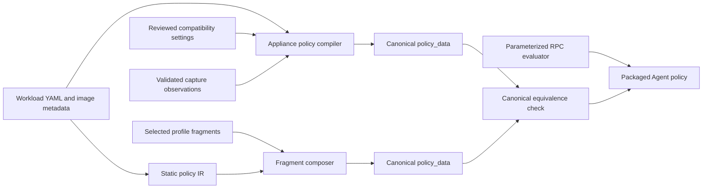

# GenPolicy Evaluator Operand Migration

## Status

This document describes the completed migration that makes the appliance
policy compiler and fragment policy composer produce the profile-sensitive
data used to authorize Kata Agent RPC requests.

Implementation started on 2026-08-12. The first increment makes the appliance
policy compiler emit the existing shared `framework` data and moves the CDI
VFIO annotation prefix, device-number grammar, Agent device-ID prefix, and PCI
option grammar from `rules.rego` into typed `devices.vfio` policy data. Legacy
GenPolicy settings and the selected framework profile both produce these
values, with compiler serialization and Rego mutation-negative coverage.

Subsequent increments moved mount and rootfs compatibility, bundle grammars,
the substitution vocabulary, namespace and capability normalization, CopyFile
and request-shape operands, and ARP compatibility into typed policy data. The
dm-verity evaluator now compares each container marker's ordered root-hash
array with the request array instead of accepting existential membership.
Schema-version, missing-field, wrong-type, unknown-field, unresolved-token,
producer-equivalence, and evaluator-consumed-path checks fail closed.

The existing `src/tools/genpolicy/rules.rego` remains the endpoint and request
field coverage baseline. Its control flow is retained, but its literals,
regular expressions, paths, substitution vocabulary, compatibility branches,
and profile-sensitive allow/deny operands are not retained as evaluator-owned
authority. Stable Agent RPC endpoint enable/disable defaults remain part of the
evaluator.

!!! success "Evaluator operand contract implemented"
    `genpolicy-oci-compiler`, Legacy GenPolicy, and the selected profile emit
    the versioned evaluator contract consumed by `rules.rego`. Canonical claim
    equality and serialized consumed-path tests prevent producer drift.

## Decision

The appliance policy compiler, Legacy GenPolicy, and fragment policy composer
must emit the same versioned evaluator-data contract. The packaged evaluator
must fail closed when that contract is absent, incomplete, malformed, or for a
different evaluator schema version.



`rules.rego` continues to implement the Agent RPC algorithm. It may traverse a
request, compare fields, enforce uniqueness, correlate values, maintain state,
and apply a selected exact or regular-expression comparison. It may not decide
which concrete value, pattern, path, token, driver, option, field alias,
or compatibility exception makes a payload comparison pass. It may decide
whether an Agent API endpoint is enabled when that decision is stable across
deployment pipeline profiles and versions.

The compiler does not learn authority from captured host values. Workload and
image facts come from the static inputs; compatibility operands come from
version-pinned settings; dynamic request values are accepted only through
generated constraints and evaluator-enforced correlations. Capture remains
diagnostic evidence used to verify coverage.

## Evaluator Boundary

The following behavior remains in the evaluator:

- Agent RPC rule names, request decoding, and stable endpoint enable/disable
  defaults;
- exact, set, ordered-array, anchored-regex, and numeric comparison algorithms;
- collection cardinality, uniqueness, and one-to-one matching;
- null, presence, absence, and request-shape checks;
- bind-once state operations and cross-request correlations;
- cross-field correlations such as container ID to selected container policy;
- range checking and path-traversal detection as algorithms; and
- stable rootfs identity semantics, including guest-pull and dm-verity policy
  marker type dispatch, ordered root-hash equality, digest identity comparison,
  and the host-independent pause-image special case; and
- fail-closed behavior for unknown endpoints or invalid policy data.

The following behavior moves to generated policy data:

- field names, annotation keys, annotation prefixes, and role values;
- exact strings, numeric masks and values, sets, and regular expressions;
- filesystem paths, path formats, and rootfs mount-point alternatives;
- placeholder tokens, permitted substitution contexts, and compatibility
  parameters used by substitution;
- namespace aliases, capability prefixes, file-type names, and other wire
  representation aliases;
- deployment-sensitive mount and storage types, filesystem types, drivers,
  options, paths, and transport source grammars;
- device paths, CDI conventions, VFIO identifiers, and PCI option grammar;
- deployment-specific image-reference forms, while canonical digest identity
  validation remains evaluator-owned; and
- every profile-specific exception branch, including sysfs and cgroup mount
  compatibility.

An algorithm being stable does not automatically make its operands
version-independent. For example, checking a block source with a regular
expression is evaluator logic, while a deployment-sensitive transport driver
name and source expression are policy data. Conversely, the synthetic
`dmverity-roothashes` and `guest-pull-images` policy types are stable interfaces
between the compiler and evaluator. Their type dispatch can remain in
`rules.rego` together with the rootfs identity comparison they select.

## Implemented Contract

`policy_data.evaluator_schema_version` selects the required evaluator contract.
Typed operands remain in their owning `framework`, `common`, `devices`,
`cluster_config`, and `request_defaults` objects. Workload constraints remain
in `containers`, `sandbox`, and request-specific data; they are not copied into
a second runtime rule language.

```json title="policy_data evaluator contract (abbreviated)"
{
  "evaluator_schema_version": 1,
  "framework": {
    "annotations": {
      "sandbox_name": "io.kubernetes.cri.sandbox-name"
    },
    "roles": {
      "cri_sandbox": "sandbox",
      "cri_container": "container"
    }
  },
  "common": {
    "substitutions": {
      "bundle_id": "$(bundle-id)",
      "sandbox_id": "$(sandbox-id)",
      "cpath": "$(cpath)",
      "unresolved_token_regex": "\\$\\([^)]+\\)"
    }
  },
  "cluster_config": {
    "mount_compatibility": {
      "sysfs_type": "sysfs",
      "sysfs_policy_read_write_option": "rw",
      "sysfs_request_read_only_option": "ro"
    },
    "rootfs_compatibility": {
      "guest_pull_fstype": "overlay",
      "guest_pull_driver_option_prefix": "image_guest_pull=",
      "multi_layer_option": "X-kata.multi-layer=true",
      "dmverity_roothash_option_prefix": "X-kata.dmverity.roothash=",
      "block_transports": [
        {"driver": "blk", "source_regex": "^[0-9a-f]{2}(/[0-9a-f]{2})?$"}
      ]
    }
  }
}
```

The final schema should use typed objects, not parallel arrays. Required fields
must not use Serde defaults. Unknown fields should be rejected at compiler and
composer boundaries. Empty values are valid only where the schema explicitly
defines empty as deny-all.

### Substitution contract

The existing placeholders are an implicit compatibility grammar. Their
spellings are centralized in `common.substitutions`, while the evaluator
retains explicit helpers for each existing context. The data declares the token and
its profile constant; the evaluator supplies only runtime-correlated values
such as the current bundle ID or sandbox ID.

This is parameterization of the existing matching algorithm, not a new generic
matcher DSL. The evaluator must not accept an arbitrary operation name or an
arbitrary input path from policy data. Each helper still identifies its typed
inputs and allowed substitutions. The compiler validates that:

- all required tokens are distinct and non-empty;
- a template uses only tokens allowed for that field;
- source and path regexes that require full matching are anchored;
- every token in a generated template is resolved exactly once; and
- no unresolved `$(` token remains in packaged policy data unless that field's
  typed contract explicitly allows runtime substitution.

## Evaluator Audit

The migration unit is an evaluator family, including all clauses of every rule
in that family. The table distinguishes retained algorithms from operands that
must be emitted by each producer.

| Family | Retained evaluator behavior | Generated operands |
| --- | --- | --- |
| Endpoint defaults and gates | RPC rule names, unknown-endpoint denial, response shape, and stable enabled/disabled decisions | None unless an enabled endpoint has profile-sensitive payload constraints |
| Create-container preflight | presence, null, empty-collection, and equality checks | fields whose required shape can vary by RPC/profile; required empty/null values |
| State helpers | add, match, remove, JSON Patch construction | state key prefixes and any compatibility-sensitive key names |
| Pod identity | bind once and compare all later occurrences | annotation keys, CRI roles, log-directory format |
| Annotation checks | exact or regex matching and iteration | accepted prefixes, role values, runtime annotation patterns |
| Container-role dispatch | correlate CRI and Kata roles | annotation keys, sandbox/container role values, required/missing fields by role |
| Devices | cardinality, uniqueness, per-device correlation | VFIO path, CDI prefix, numeric suffix regex, ID prefix, PCI option regex, device types |
| Linux configuration | compare namespaces, paths, devices, sysctls, and seccomp | ignored namespace types, namespace aliases, path semantics, permitted compatibility omissions |
| Root and bundle | anchored match and bundle-ID extraction | root template, root path, bundle-ID regex and capture group contract |
| Process and user | exact and set comparisons | capability aliases and prefixes, permitted capability presets |
| Arguments | ordered comparison and typed substitutions | escape marker, node-name behavior, sandbox-name token and permitted sites |
| Environment | exact/regex match, name/value split, IP validation | all tokens, service regexes, IP grammar, field-ref categories and value patterns |
| Mounts | one-to-one matching, destination/type/options comparison | source templates, token values, sysfs exception, cgroup exception and extra options |
| Storages | one-to-one matching; stable `image_guest_pull`, `guest-pull-images`, and `dmverity-roothashes` type dispatch; marker exclusion; ordered dm-verity root-hash equality; guest-pull digest identity; host-independent pause handling; per-container rootfs identity correlation | deployment-sensitive filesystem types, rootfs option strings, transport drivers and source regexes, driver-option prefixes, and rootfs paths |
| Capabilities | normalize and compare sets | `CAP_` prefix, default/privileged markers and capability sets |
| CopyFile | range, traversal, relative-symlink, path matching | file-type values, traversal regex, symlink top-level suffix, path templates, bundle-ID regex |
| CreateSandbox | endpoint decision, request traversal, and exact comparison | pid namespace value, hook/module shape, sandbox storages |
| ExecProcess | command comparison and container-state lookup | commands, command regexes, port defaults, capability policy and prohibited process fields |
| Routes | iterate routes and reject matches | forbidden source regexes and device names |
| Interfaces | bitmask operation and set exclusion | allowed raw-flags mask, forbidden names and hardware addresses |
| ARP neighbors | iterate and compare mask, states and flags | forbidden devices/CIDRs, allowed states, empty mask, required flag mask/value |
| Stream and diagnostics | endpoint dispatch and stable allow/deny decisions | profile-sensitive payload constraints, if introduced |
| Removal and lifecycle | endpoint decision, state cleanup, or structural dispatch | profile-sensitive request constraints, if any |

### Mount source assessment

`mount_source_allows` is the desired shape for evaluator code only after all of
its operands are data-owned. It should continue to select an allowed generated
mount, substitute trusted shared-path constants and runtime-correlated IDs,
require anchoring, and call `regex.match`. The mount source template already
belongs to the per-container policy.

The remaining hardcoded token spellings and substitution sequence must move to
the typed substitution contract. The evaluator must reject a source template
that contains an unknown token or remains unresolved. The policy compiler must
continue to derive each mount source template from YAML volume intent, image
metadata, and versioned runtime settings, never from the captured mount source.

### Storage assessment

`allow_storages` combines stable rootfs security semantics with
deployment-sensitive runtime compatibility operands. These must be separated,
not moved as one block.

The three names have different roles:

`image_guest_pull`
:   A real storage driver discriminator in the Agent's
  `CreateContainerRequest.storages`. It identifies a requested guest-pull
  rootfs operation.

`guest-pull-images`
:   A synthetic, policy-only storage type. Its options carry the current
  container's compiler-generated allowed guest-pull image identities. The
  Agent never sends this marker as request storage.

`dmverity-roothashes`
:   A synthetic, policy-only storage type. Its options carry the current
  container's compiler-generated ordered dm-verity root hashes. The Agent
  never sends this marker as request storage.

The type strings and their request-versus-policy roles are stable evaluator
interfaces and remain in `rules.rego`. The similarly named
`image_guest_pull=` driver-option prefix describes a runtime representation and
comes from policy data.

Retain the following in `rules.rego`:

- differentiation among the `image_guest_pull` request type and the
  `guest-pull-images` and `dmverity-roothashes` policy-only marker types;
- exclusion of policy-only marker entries from request storage cardinality;
- selection of this container's marker rather than a pod-wide or global rootfs
  identity set;
- ordered, straight equality between the dm-verity root hashes generated for
  the container and the hashes presented for that rootfs class;
- guest-pull image identity comparison by canonical manifest digest; and
- the literal `pause` special case, because pause is a trusted UVM-local
  identity and all untrusted host-side image configuration is ignored.

These rules define stable rootfs authorization semantics. They do not vary with
Kubernetes, containerd, runtime-rs, or deployment pipeline profile versions.
The producer supplies the per-container hash or image identity values, but it
does not redefine how identities are compared.

!!! success "Ordered dm-verity equality implemented"
  `rules.rego` extracts exactly one generated-prefix root hash from each
  dm-verity request storage in request order and compares the resulting array
  directly with the container's compiler-generated marker options.

Move the runtime-sensitive operands to typed policy data, including:

- EROFS multi-layer, overlay upper/lower, and dm-verity option strings and
  option prefixes;
- `blk`, `scsi`, `mmioblk`, `blk-ccw`, and `nvdimm` source grammars;
- `overlay`, `ext4`, `erofs`, local, bind, tmpfs, and hugetlbfs values;
- two `/run/kata-containers/.../rootfs` path forms;
- deployment-sensitive driver-option and block-volume empty-field conventions;
  and
- any future filesystem option or filesystem type introduced by runtime-rs.

Retain storage bijection, cardinality, and per-container rootfs identity
correlations. The typed storage contract describes runtime representations; it
must not let a producer redefine marker meaning, change ordered hash equality
to membership, trust a host-provided pause reference, inject executable Rego,
or select arbitrary request fields.

### Retained literal audit

The remaining authorization-affecting quoted values in `rules.rego` are stable
rootfs security interfaces:

- `image_guest_pull` is the Agent request storage discriminator;
- `guest-pull-images` and `dmverity-roothashes` are policy-only marker types;
- `pause` is the trusted UVM-local identity; and
- `^sha256:[0-9a-f]{64}$` defines canonical manifest-digest identity.

These values select stable evaluator semantics and do not vary by Kubernetes,
containerd, runtime-rs, or deployment pipeline profile. All runtime storage
representations used inside those branches are generated contract reads.

## Producer Changes

### Appliance policy compiler

`src/tools/genpolicy/appliance/policy-compiler/src/main.rs` must become a full
producer of the evaluator contract:

1. Serialize the complete versioned evaluator contract, including `framework`.
2. Load compatibility operands from the version-pinned settings bundle used by
   the appliance image. Do not copy literals from `rules.rego` into Rust source.
3. Derive workload-specific exact values and patterns from YAML, image metadata,
   and typed runtime transformations.
4. Use validated captures only to prove expected request coverage. Captured
   paths, drivers, addresses, options, or environment values do not become
   authority merely because they were observed.
5. Validate contract completeness, token use, regex anchoring, storage class
   references, and schema version before reading and packaging the evaluator.
6. Serialize canonical `policy_data`, append it to the parameterized evaluator,
   and record the settings digest and evaluator-contract version in provenance.
7. Refuse to package the Legacy evaluator when its declared consumed schema is
   newer, older, or incomplete. There is no literal fallback for old compiler
   output.

The compiler should reuse the GenPolicy library's typed contract definitions;
it must not maintain a second local shape. Its current local `PolicyData` type
is therefore replaced by, or constructed into, the shared serializable type.

### Legacy GenPolicy

Move the contract into shared Rust types under `src/tools/genpolicy/src/` and
deserialize all profile operands from `genpolicy-settings.json` and its JSON
Patch drop-ins. Legacy generation emits the same canonical shape as the
appliance compiler. Settings validation must reject missing fields, unknown
runtime storage representations, invalid regexes, duplicate tokens, and
unsupported schema versions.

The settings file is transitional authority for the non-fragment path. It must
contain every compatibility operand until the fragment profile becomes the
sole source for that profile.

### Fragment policy composer

The selected profile fragments produce the identical versioned evaluator data:

- `policy-framework-settings` owns shared annotation, role, device,
  normalization, substitution, and compatibility operands;
- `runtime-rs` owns per-container root, mount, device, and runtime annotation
  constraints derived from typed intent; and
- `runtime-rs-envelope` owns runtime storage representations, rootfs identity
  envelopes, and CopyFile roots that depend on runtime transport. It supplies
  per-container rootfs identities and filesystem representation operands, but
  not the stable marker interpretation or identity-comparison semantics.

The composer validates claim ownership and completeness against the contract
schema. It may not fill a missing operand from evaluator source. Canonical
composer output and canonical appliance compiler output must compare equal for
the same workload, images, settings, and profile.

## `rules.rego` Changes

Perform the Rego migration after the shared schema and both production paths
can emit it. For each family:

1. Replace concrete constants with required contract reads.
2. Keep all existing request-field traversal, count, uniqueness, equality,
   regex, and correlation checks.
3. Replace repeated substitution chains with typed, context-specific helpers
   that read token spelling and compatibility values from the contract.
4. Remove the corresponding literal and every compatibility fallback.
5. Add an explicit contract-version guard to every endpoint that consumes the
  generated evaluator contract. Endpoints whose stable decision needs no
  policy-data operand remain independent of the contract.
6. Add a mutation-negative test before proceeding to the next family.

No profile fragment is evaluated during an RPC request. No copied evaluator,
generic JSON-path matcher, or runtime rule mini-language is introduced.

## Migration Sequence

### Stage 1: shared contract and compiler parity

- Define shared Rust types and strict validation.
- Populate the complete contract in `genpolicy-settings.json`.
- Emit it from Legacy GenPolicy and `genpolicy-oci-compiler`.
- Emit the same shape from profile fragments.
- Add canonical producer-equivalence tests.

This stage changes data but not evaluator behavior. It exposes missing producer
coverage before any Rego literal is removed.

### Stage 2: identity, request-shape, and device operands

- Complete annotation and role migration.
- Keep stable endpoint allow/deny defaults in `rules.rego` and move only
  profile-sensitive request shape constants.
- Move CDI/VFIO paths, prefixes, ID grammar, and PCI patterns.
- Move namespace and capability normalization operands.

### Stage 3: roots, mounts, and substitutions

- Move root and bundle-ID grammar.
- Centralize the typed substitution contract.
- Move sysfs and cgroup compatibility branches.
- Require complete token resolution and anchored patterns.

### Stage 4: storage and rootfs

- Keep stable rootfs type differentiation, marker exclusion, ordered dm-verity
  hash equality, digest identity comparison, and pause special handling in
  `rules.rego`.
- Move filesystem types, rootfs option strings and prefixes, transport driver
  and source grammars, and rootfs paths into policy data.
- Preserve storage bijection and per-container rootfs identity checks; compiler
  output supplies identities but cannot select weaker comparison semantics.
- Remove global or cross-container rootfs identity fallback.

### Stage 5: process, environment, CopyFile, and network RPCs

- Move argument/environment placeholder categories and value grammars.
- Move file types, traversal expression, and CopyFile path suffixes.
- Move route, interface, and ARP constants and masks.
- Verify all request-default fields are typed and consumed.

### Stage 6: literal-free authorization audit

Classify every remaining string, number, set, and regex in `rules.rego` as one
of:

- Rego syntax or diagnostic text;
- Agent RPC field access or rule name fixed by the evaluator API; or
- a generated contract read.

Any remaining value that can change allow/deny behavior requires an explicit
review record explaining why it is an Agent API invariant. The build must fail
if the evaluator's declared consumed paths differ from the producer's emitted
paths.

## Validation Plan

Each migrated operand family requires all of the following:

- a positive replay through the same `data.agent_policy.<Endpoint>` query;
- mutation-negative tests changing each generated exact value, regex, path,
  mask, option, driver, token, and role independently;
- missing-field, wrong-type, unknown-field, and wrong-schema rejection;
- compiler tests proving the value is present in serialized policy data;
- composer tests proving the selected profile owns the same value;
- canonical compiler/composer equality for representative workloads;
- tests proving captures cannot widen the generated constraint; and
- regression tests preserving all Legacy request fields, cardinality checks,
  uniqueness checks, and state operations.

Security-sensitive scenarios require dedicated tests:

| Scenario | Required rejection |
| --- | --- |
| Missing contract | Every endpoint that consumes contract operands fails closed; stable operand-free endpoint decisions remain evaluator-defined |
| Old compiler with new evaluator | Packaging fails before installation |
| Unknown or unresolved token | Compilation/composition fails |
| Unanchored full-match pattern | Compilation/composition fails |
| Mutated generated storage transport or filesystem option | Only the matching storage branch denies |
| Reordered, missing, or additional dm-verity root hash | CreateContainerRequest denies by ordered equality |
| Rootfs hash from another container | CreateContainerRequest denies |
| Host supplies alternate pause image configuration | Configuration is ignored; only the evaluator's UVM-local `pause` identity rule applies |
| Extra mount, storage, or device | Cardinality or uniqueness check denies |
| Mutated request operand | Only the affected payload authorization branch changes |
| Captured host path differs from settings-derived path | Capture is reported, not authorized |

Run focused Regorus and OPA tests for each family, Rust unit tests for both
producers, appliance end-to-end policy replay, and the existing GenPolicy policy
suite. Documentation lint and canonical generated-output checks complete the
change.

## Completion Criteria

The migration is complete only when:

- `genpolicy-oci-compiler`, Legacy GenPolicy, and the fragment composer emit the
  same required evaluator contract;
- every profile- or deployment-sensitive authorization operand in `rules.rego`
  is a policy-data read, while each retained stable operand has an explicit
  Agent API or rootfs security-invariant justification;
- every consumed policy-data path has exactly one declared producer owner;
- missing or incompatible contract data fails before or during policy loading,
  never by falling back to evaluator literals;
- all Legacy RPC branches and request-field checks remain covered;
- mutation of every generated operand is observed by an authorization test;
  and
- appliance policy provenance identifies the compatibility settings and
  contract schema that produced the installed policy.

At that point, the appliance policy compiler generates the tightened policy it
claims to generate: the evaluator supplies the authorization machinery, while
the compiler-produced `policy_data` supplies workload decisions and profile
compatibility operands. Stable Agent endpoint and rootfs identity semantics
remain in the evaluator.
