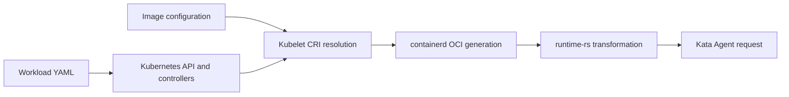
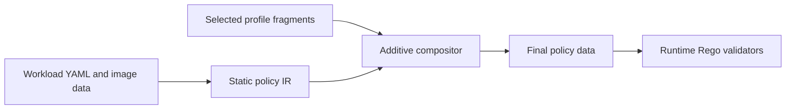

# GenPolicy Rego Fragments

## Status

This document proposes a design for separating workload-static policy from
versioned platform mutations. It does not describe functionality currently
implemented by Kata Agent or GenPolicy.

## Motivation

GenPolicy currently predicts the complete `CreateContainerRequest` that Kata
Agent will receive. That request is not produced directly from workload YAML.
It is the result of a pipeline:



The prediction embeds behavior from specific Kubernetes, containerd, and Kata
versions in GenPolicy. Component upgrades can therefore cause policy drift even
when workload intent has not changed.

The proposed design makes GenPolicy responsible only for static workload and
image constraints. Versioned **Rego fragments** validate mutations introduced
by the platform profile. The name and composition model follow the hcsshim
security-policy fragment design, including fragment identity by issuer, feed,
namespace, and security version number (SVN). The main adaptation is that Kata
fragments validate platform mutations rather than contribute additional
containers.

The hcsshim design provides useful precedents:

- a base policy explicitly authorizes a fragment issuer, feed, minimum SVN, and
  exported content;
- each fragment is isolated in a Rego package namespace;
- fragment framework compatibility is explicit;
- fragment loading fails closed on identity, namespace, or SVN mismatch;
- `platform_rules` can contribute platform-owned environment and mount rules.

See the hcsshim
[`framework.rego`](https://github.com/microsoft/hcsshim/blob/main/pkg/securitypolicy/framework.rego),
[`securitypolicyenforcer_rego.go`](https://github.com/microsoft/hcsshim/blob/main/pkg/securitypolicy/securitypolicyenforcer_rego.go),
and
[`platform_rules.rego`](https://github.com/microsoft/hcsshim/blob/main/pkg/securitypolicy/fragment_test_policies/platform_rules.rego).

## Goals

- Generate exact policy constraints from workload YAML and digest-bound image
  configuration without predicting platform implementation details.
- Assign every platform mutation to one category and one owning fragment.
- Reuse reviewed fragments across workloads with the same measured profile.
- Correlate generated values with static workload intent and with other values
  in the same request.
- Reject unknown fields, unclaimed mutations, fragment overlap, and profile
  mismatch.
- Derive candidate fragments from capture evidence, then require review and
  negative tests before publication.

## Non-goals

- Trusting containerd or runtime-rs merely because a captured request contains
  self-consistent values.
- Automatically proving a safe rule from a finite set of captures.
- Allowing fragments to add arbitrary workload identities, commands, devices,
  storages, environment variables, or mount destinations.
- Treating component version strings as a complete profile identity.
- Supporting arbitrary admission webhooks, CSI drivers, or device plugins
  without including their configuration and evidence in the profile.

## Terminology

Static policy
:   Constraints derived from trusted workload YAML, referenced ConfigMaps and
    Secrets, and image configuration bound to a manifest digest.

Static policy IR
:   A compiler intermediate representation containing only static policy plus
  stable workload subject identifiers. It deliberately omits every
  profile-owned final-policy field.

Mutation
:   A field addition, default, resolution, rewrite, removal, normalization, or
    generated value between static input and the Agent-visible request.

Fragment
:   A reviewed mutation module that materializes profile-owned final-policy
  constraints at build time and validates the same claims at runtime.

Profile
:   The complete set of component versions, configurations, binaries, and
    operating modes that determine request mutation behavior.

Claim
:   A JSON-pointer path or typed collection role that a fragment exclusively
    owns and must validate.

## Additive Composition Model

The composition operation is purely additive. GenPolicy first emits a static
policy IR with stable subjects derived from workload intent, for example
`container/sidecar`, `container/workload`, or
`sandbox/default/balanced-mode`. A fragment can add an absent constraint below
one of those subjects. It cannot replace or delete static data.



The final policy produced by composition is:

$$
P = S \oplus M_1 \oplus M_2 \oplus \dots \oplus M_n
$$

where $S$ is the static IR and each $M_i$ is a set of additions at previously
absent paths. The operator $\oplus$ is defined only when all target subjects
exist, all target paths are absent, and no two fragments claim the same target.
Composition fails otherwise.

This is simpler than applying general JSON Patch or allowing arbitrary Rego to
construct policy data. In particular:

- stable workload subject IDs select containers; array indexes and
  profile-generated CRI annotations do not;
- fragment order cannot affect the result when claims are disjoint;
- an addition cannot overwrite a static constraint;
- duplicate, missing, or ambiguous subjects fail composition;
- the final policy contains ordinary policy data and can use the existing
  Agent policy interface.

A platform transformation described as a rewrite is still additive at this
boundary. For example, the static IR omits the host root path and the
runtime-rs fragment adds the final `$(root_path)` constraint. A platform
removal is represented by an absence assertion checked by the fragment; it is
not permission to delete a static constraint. If a purported fragment needs
to overwrite trusted YAML or image data, the mutation classification or trust
boundary is wrong.

## Runtime Authorization Model

Let $P$ be the composed final policy, $Q$ the Agent-visible request, and $F_i$
a fragment validator. Authorization requires the final static constraints and
every selected fragment to agree:

$$
allow(P,Q) = static(P,Q) \land \bigwedge_{i=1}^{n} F_i(P,Q,C)
$$

$C$ contains values bound from the same request, such as sandbox ID, bundle ID,
Pod UID, sandbox name, and namespace. Fragments compose by intersection, not by
union. A fragment cannot make a request valid after static policy rejects it.

Each final request field must be one of:

1. validated directly by static policy;
2. claimed and validated by exactly one fragment;
3. explicitly shared by fragments through a documented dependency; or
4. rejected as unclaimed.

Collections require role-based ownership rather than index ownership. Mounts
are keyed by destination and purpose, environment entries by variable name,
storages by driver and correlated mount point, and namespaces by type. Array
ordering is not a mutation unless the protocol gives ordering semantic meaning.

!!! warning "Fragments are validators, not authorities"
    API server, kubelet, containerd, and runtime-rs are outside the Kata-CC
    trust boundary. A fragment describes the request shape that trusted Agent
    policy permits; it does not make the producing component trusted.

## Mutation Operations

Every claim records one operation. This makes fragment review about a bounded
transformation rather than a complete request template.

| Operation | Meaning | Example |
| --- | --- | --- |
| `default` | Add a fixed value when workload input omits it | OCI version |
| `generate` | Create a deployment-specific value with a bounded grammar | Pod UID |
| `resolve` | Resolve a declared reference against profile state | `fieldRef`, ConfigMap environment |
| `derive` | Compute a value from static input or another bound value | hostname from Pod name |
| `normalize` | Convert representation without changing intent | capabilities compared as a set |
| `rewrite` | Add only the final guest-oriented constraint; the host form is absent from static IR | Kata rootfs path |
| `remove` | Assert that a profile-owned final field is absent; never delete static data | guest Seccomp disabled |
| `envelope` | Add transport metadata around a statically authorized identity | guest-pull driver options |

The fragment manifest records the operation, owned path or role, static anchor,
correlations, evidence, and whether absence is also meaningful.

## Mutation Categories

### Static workload and image

This category is not a fragment. GenPolicy owns it.

| Data | Treatment |
| --- | --- |
| Manifest digest | Exact |
| Command and arguments | Exact, using Kubernetes image/YAML precedence |
| Working directory | Exact |
| Image and YAML environment | Exact after static precedence resolution |
| UID, GID, and supplementary groups | Exact |
| Capabilities and no-new-privileges | Exact set/value |
| Root read-only state | Exact |
| Volume role and destination | Exact |
| Probe and lifecycle commands | Exact |

Static data must not contain containerd-generated root paths, CRI annotations,
host mount paths, or runtime-rs storage objects. It does contain stable subject
IDs and static anchors needed by fragment additions, such as container name,
volume role, destination, image digest, command, and environment-variable name.

The first static IR prototype derives the following constraints without reading
either generated policy:

- command and arguments using Kubernetes image/YAML precedence;
- image environment plus literal YAML, ConfigMap, and Secret precedence;
- explicit or image working directory;
- explicit no-new-privileges and read-only-rootfs intent;
- probe and lifecycle exec commands; and
- unresolved `valueFrom` declarations as typed `resolve` anchors, not captured
  values.

It rejects image references that are not manifest-digest bound. It does not yet
classify user and group resolution, capability deltas other than explicit final
sets, volume intent, or sandbox policy as static.

### Kubernetes API and controller fragment

This fragment owns object mutations visible after API admission and controller
reconciliation:

- generated Pod name and UID;
- namespace defaulting;
- Deployment, Job, and other controller-generated Pod identity;
- restart, DNS, scheduler, probe, and termination-message defaults;
- service ClusterIP and assigned service-port values.

Only defaults that influence an Agent request need runtime Rego rules. Other
defaults remain provenance evidence. Generated names and UIDs use bounded
grammars and are bound once for reuse by later fragments.

Admission webhooks are separate fragments because Kubernetes version alone does
not identify their behavior.

### Kubelet resolution fragment

This fragment owns translation from the bound Pod to CRI input:

- `fieldRef`, `resourceFieldRef`, ConfigMap, and Secret environment resolution;
- service-link environment variables;
- Pod hostname;
- termination-message and Kubernetes-managed file mounts;
- resource-to-cgroup calculations;
- Pod security-context projection into OCI user and group fields;
- kubelet-prepared volume sources.

Resolution must remain anchored to static declarations. For example, the
fragment can permit `POD_UID=<bound Pod UID>` but cannot permit an arbitrary
environment variable with a UUID value. Service rules pin the statically
declared Service and port names while allowing only typed endpoint values.

Capturing the CRI boundary between kubelet and containerd is required before
this category can be separated completely from containerd OCI generation.

### containerd OCI fragment

This fragment owns conversion from CRI input to the raw OCI specification:

- OCI specification version;
- CRI annotations;
- sandbox OCI defaults;
- default sysctls, masked paths, read-only paths, capabilities, and resources;
- host-oriented standard mounts;
- cgroup path generation;
- ordering-insensitive normalization of set-like fields.

The fragment must validate absence as well as presence. A version that does not
emit an annotation or sysctl requires that field to remain absent.

The current containerd 1.7.29 and 2.3.3 capture comparison found three stable
differences across five workloads and eleven paired create requests:

| Claim | containerd 1.7.29 | containerd 2.3.3 | Request scope |
| --- | --- | --- | --- |
| OCI version | `1.1.0` | `1.3.0` | Sandbox and containers |
| `io.kubernetes.cri.podsandbox.image-name` | Absent | Exact profile pause reference | Sandbox |
| Sandbox sysctls | Absent | `ip_unprivileged_port_start=0` and `ping_group_range=0 2147483647` | Sandbox |

Capability, environment, and mount ordering differed but their semantic sets
did not. Generated IDs, ClusterIPs, CNI paths, and Kata path hashes are not
containerd-version claims.

### runtime-rs fragment

This fragment owns the raw-OCI to Agent-request transformation:

- root path rewrite to `/run/kata-containers/<bundle-id>/rootfs`;
- PID, network, IPC, UTS, mount, and cgroup namespace normalization;
- host mount source rewrite into Kata guest-visible domains;
- `/dev/shm` rewrite to `/run/kata-containers/sandbox/shm`;
- Kata bundle and container-type annotations;
- Agent `Storage` and `Device` construction;
- `shared_mounts` and `sandbox_pidns` request fields;
- Seccomp removal when enabled by trusted Kata configuration.

Root paths, storage mount points, and bundle annotations must bind the same
bundle ID. Sandbox-scoped mount and storage paths must bind the same sandbox ID.
The fragment rejects internally consistent but statically unanchored identities.

### Rootfs and storage-mode fragment

Storage behavior merits a separate fragment because it depends on trusted Kata
configuration and snapshotter artifacts, not only runtime-rs version:

- guest pull: exact manifest digest or the special pause identity;
- EROFS/dm-verity: exact root hash, layer identity, driver, and options;
- shared filesystem: source constrained to the configured shared domain;
- `shared_fs = "none"`: Agent-local disk `emptyDir` fallback;
- encrypted block `emptyDir`: encryption options and device correlation;
- plain block `emptyDir`: explicit opt-in and exact unencrypted shape;
- memory `emptyDir`: exact tmpfs storage shape;
- ConfigMap, Secret, downward API, and projected-volume copy-to-guest rewrites.

This category consumes static volume intent but cannot change volume role,
destination, access mode, or encryption requirement.

### Generated identity and correlation framework

Generated identities are shared facts, not an independent source of
authorization. The common framework binds each value once and fragments reuse
it:

| Fact | Constraint |
| --- | --- |
| Bundle/container ID | Bounded hexadecimal ID extracted from the Kata root path or bundle annotation |
| Sandbox ID | Bounded hexadecimal ID from CRI annotation |
| Pod UID | UUID grammar bound to API evidence |
| Sandbox name | Controller grammar anchored to static workload name |
| Namespace | Static namespace or API default |
| Node name | Profile-bound or explicitly parameterized value |
| CNI namespace | Anchored profile path with bounded identifier |

Independent regular expressions for repeated identities are forbidden because
they lose relational integrity.

## Fragment Format

A fragment has one claim manifest used by both compiler-time materialization
and runtime validation. The materializer is deliberately data, not executable
Rego, so its write capability is constrained to adding declared values at
absent paths. Runtime Rego uses the same claims to validate the request.

```json title="containerd-2.3.3.fragment.json"
{
  "schema_version": 1,
  "category": "containerd-oci",
  "claims": [
    {
      "operation": "default",
      "target": {
        "subject": "container/workload",
        "path": "/OCI/Version"
      },
      "value": "1.3.0"
    }
  ]
}
```

The corresponding namespaced Rego exports metadata plus validators:

```rego title="containerd-2.3.3.rego"
package kata_fragment_containerd_2_3_3

fragment := {
    "framework_version": "0.1.0",
    "category": "containerd-oci",
    "issuer": "did:web:profiles.katacontainers.io",
    "feed": "kubernetes-1.33/containerd-2.3.3/linux-amd64-cgroup-v2",
    "svn": "1",
    "profile_identity": "sha256:<canonical-profile-hash>",
    "claims": data.fragment_claims,
}

validate(static, request, context) := {"allowed": true} if {
    request.OCI.Version == "1.3.0"
    allow_sysctls(request)
    allow_pause_annotation(static, request, context)
}
```

Issuer, feed, and minimum SVN adoption follows hcsshim. The base policy lists
the exact fragments it accepts:

```rego title="static-policy.rego"
fragments := [
    {
        "issuer": "did:web:profiles.katacontainers.io",
        "feed": "kubernetes-1.33/containerd-2.3.3/linux-amd64-cgroup-v2",
        "minimum_svn": "1",
        "category": "containerd-oci",
        "profile_identity": "sha256:<canonical-profile-hash>",
    },
]
```

The exact signing and distribution mechanism is independent of the mutation
taxonomy. A COSE envelope and transparency receipts can be added without
changing fragment validator semantics.

## Profile Identity

A fragment feed is readable metadata, not sufficient compatibility proof. The
canonical profile identity hashes at least:

- Kubernetes, kubelet, containerd, runtime-rs, runc, CNI, and Agent versions;
- kubelet, containerd, Kata, CNI, and policy-framework configurations;
- architecture, cgroup mode, rootfs mode, snapshotter, and pause image;
- capture backend and request-authority implementation;
- enabled admission, controller, CSI, and device-plugin fragments;
- hashes of binaries and configuration artifacts used to derive the fragment.

The existing appliance `profile.json` and capture manifest provide the initial
canonicalization and artifact hashes.

## Composition And Conflict Rules

1. Each required category has exactly one selected fragment unless the category
   explicitly supports sub-fragments.
2. A claim has one owner. Duplicate claims fail composition.
3. Dependencies are explicit. For example, runtime-rs may consume a bundle ID
   bound by the common framework but cannot redefine it.
4. Static fields cannot be claimed by fragments.
5. A materialized claim only adds an absent path. Replace and delete operations
  are not part of the fragment format.
6. Unknown fields and unclaimed collection elements fail closed.
7. Missing required fragments, profile hash mismatch, unsupported framework
   versions, and SVN rollback fail before workload execution.

Composition produces a claim ledger that is retained beside the policy:

```json title="fragment-claims.json"
{
  "schema_version": 1,
  "claims": [
    {
      "category": "containerd-oci",
      "operation": "default",
      "path": "/OCI/Version",
      "fragment": "kata_fragment_containerd_2_3_3",
      "evidence": ["raw-oci/container.config.json"]
    }
  ]
}
```

The ledger also records the static subject ID and a digest of the materialized
value. This permits an auditor to reproduce composition without executing the
runtime validator.

## Executable Design Check

An initial compositor prototype lives in
`src/tools/genpolicy/appliance/scripts/compose_policy_fragments.py`, with tests
in `src/tools/genpolicy/appliance/tests/test_compose_policy_fragments.py`. It
uses the checked-in `run-complex` policy compiler output as a golden result.

The test removes representative containerd and runtime-rs fields from the
compiler result to form a static IR, assigns each container a stable workload
subject ID, applies additive fragments, and compares the materialized
`policy_data` structurally with the compiler output. It currently demonstrates:

- exact reconstruction of OCI version defaults and Kata root-path constraints;
- selectors that remain correct after subject-array reordering;
- rejection of duplicate claims;
- rejection when an addition would overwrite static data; and
- rejection of an unknown subject.

This proves that additive fragments can reproduce the selected compiler-owned
fields without Agent changes. It is not yet proof that the complete policy has
been partitioned correctly: the current static IR fixture is derived by
subtracting selected fields from compiler output. The next implementation step
is for GenPolicy to emit the static IR directly and for a coverage report to
show that every non-static final-policy field came from exactly one fragment.

### Independently generated static slice

A second prototype in
`src/tools/genpolicy/appliance/scripts/prototype_static_policy.py` generates a
sparse static IR directly from capture-bundle `workload.yaml` and digest-bound
image configuration. It does not read Legacy or request-derived policy while
generating constraints. It then compares those constraints with both policy
outputs and uses the bundle only for mutation provenance.

The checked local containerd 1.7.29 and 2.3.3 complex-workload bundles produced
the following result:

| Measurement | containerd 1.7.29 | containerd 2.3.3 |
| --- | ---: | ---: |
| Static constraints generated | 9 | 9 |
| Matching Legacy constraints | 9 | 9 |
| Matching request-derived compiler constraints | 9 | 9 |
| Unresolved `valueFrom` anchors retained | 3 | 3 |

The constraints cover two workload containers. They include arguments,
environment subsets, working directories, no-new-privileges, and exec commands.
The result is evidence that these fields can move out of profile-specific
generation without changing either policy implementation.

### Legacy settings contribution

The prototype also merges `genpolicy-settings.json`, appliance and profile JSON
patches, and the patch derived from trusted Kata configuration in the same
order as Legacy GenPolicy. Comparison is performed at scalar leaf paths rather
than whole settings objects.

For the containerd 2.3.3 complex-workload policy:

| Destination | Exact settings leaves | Changed leaves | Not serialized |
| --- | ---: | ---: | ---: |
| Legacy policy | 111 | 0 | 5 |
| Request-derived policy | 96 | 15 | 5 |

The five non-serialized leaves are generator inputs: image-layer verification
and NVIDIA/VFIO matching configuration. The request-derived compiler changes
15 inherited `allow_env_regex` entries because it replaces broad Legacy service
environment patterns with capture-derived handling. Therefore a settings file
is useful mutation evidence, but its complete object is not itself a fragment.
Only emitted leaf constraints or explicit transformation rules can become
claims.

### Capture-layer evidence

For the same containerd 2.3.3 bundle, provenance analysis recorded:

| Layer | Evidence entries | Interpretation |
| --- | ---: | --- |
| Static image configuration | 4 | Direct image matches also found by capture analysis |
| Kubelet or containerd | 76 | Cannot be separated until the CRI boundary is captured |
| runtime-rs | 24 | Direct field evidence after comparing raw OCI with the Agent request |
| runtime-rs transformations | 28 | Added, changed, or removed request fields |

The controlled 1.7.29-to-2.3.3 comparison has equal static input hashes and can
be attributed to the containerd profile family. It still reports residual
generated IDs, paths, mounts, environment values, and storages. Those residuals
must be normalized by typed identity correlation before individual differences
become fragment claims. Component-family attribution alone is insufficient.

!!! warning "Current proof boundary"
  The independently generated static slice proves selected static fields and
  the capture proves several mutation boundaries. It does not yet prove full
  final-policy reconstruction. Full proof requires extending the static IR,
  deriving every mutation claim from settings or capture evidence, and
  requiring complete additive reconstruction of policy-compiler output with
  no unclaimed leaf paths.

## Capture And Fragment Derivation

Fragment candidates are derived only from controlled profile comparisons:

1. Hold workload YAML, image manifests, Kubernetes version, Kata configuration,
   and every unrelated profile dimension constant.
2. Change one component or configuration dimension.
3. Pair requests by workload identity and container role.
4. Normalize generated values by typed role and correlation, not broad regex.
5. Classify each residual difference by mutation operation and category.
6. Repeat across a workload matrix that exercises each relevant field.
7. Generate a candidate fragment and claim ledger.
8. Require review, negative tests, and replay before publication.

If more than one profile dimension changes, the result records candidate causes
and cannot automatically assign fragment ownership.

The required long-term capture boundaries are:


The appliance already captures all boundaries except kubelet CRI requests.
Until a recording CRI proxy is added, kubelet and containerd ownership is
partially ambiguous and must be reviewed conservatively.

## Agent Integration

Kata Agent currently installs one policy in one Regorus engine.
`SetPolicyRequest` replaces that engine and does not add a module. There is no
current issuer/feed/SVN, signature, or additive-module API.

Implementation is therefore staged:

### Phase 1: build-time composition

- The appliance selects fragments by exact profile identity.
- GenPolicy emits a static policy IR containing no profile-owned fields.
- The compiler verifies claim ownership, framework compatibility, SVN, stable
  subject existence, and target-path absence.
- It additively materializes claim values and composes namespaced runtime Rego
  validators into one policy text.
- The existing `SetPolicyRequest` installs the resulting policy atomically.
- Fragment descriptors, hashes, claims, and evidence remain in provenance.

This phase provides the static/mutation separation and fragment reuse without
changing the Agent RPC API.

### Phase 2: authenticated runtime loading

- Extend the Agent protocol with a fragment envelope carrying issuer, feed,
  namespace, SVN, Rego, and optional signature evidence.
- Add Regorus module lifecycle support without replacing policy state.
- Perform pre-load identity and minimum-SVN checks.
- Load into an isolated namespace, evaluate post-load metadata and claims, and
  remove the module on any failure.
- Seal the required fragment set before processing workload requests.

The two-phase pre-load/post-load validation used by hcsshim is the preferred
model for this phase.

## Validation

Every fragment requires:

- positive replay of all paired requests in its capture matrix;
- rejection after changing every claimed exact value;
- rejection of extra and missing claimed fields;
- rejection of an extra mount, storage, device, namespace, environment entry,
  annotation, or sysctl;
- correlation tests that change only one occurrence of a repeated identity;
- static-anchor tests that substitute another digest, command, destination, or
  volume role;
- order permutation tests for set-like collections;
- profile hash, namespace, framework version, issuer, feed, and SVN failure
  tests;
- cross-version tests proving that a 1.7-only request is rejected by the 2.3
  fragment and conversely where their shapes differ.

The complete policy must also retain a coverage assertion: every final request
field and collection element is consumed by static policy or exactly one
fragment claim.

The build-time compositor additionally requires tests that permute fragment
and subject order, attempt to overwrite each static anchor, omit each required
claim, duplicate each claim, and compare canonical composed policy data with
policy-compiler output.

## Open Questions

- Should fragments be distributed with the Kata release, generated by cluster
  operators, or both under different issuers?
- Which profile dimensions require independent fragments rather than one
  combined feed?
- How should Regorus expose safe additive module loading and removal?
- Should API-server and kubelet fragments execute in Agent policy, or should a
  trusted compiler reduce them into final correlations before deployment?
- How should Secret-derived evidence be retained and reviewed without exposing
  plaintext in fragment provenance?
- Which admission, CSI, and device-plugin behaviors are stable enough to become
  reviewed fragments?

## Decision Summary

GenPolicy remains the authority for workload and image invariants. Fragments
add profile-owned final constraints and validate mutations by category:
Kubernetes API/controller, kubelet resolution, containerd OCI generation,
runtime-rs transformation, and rootfs/storage mode. Generated identities are
common correlated facts. Build-time composition is additive and conflict-free;
runtime composition is an intersection of validators with complete claim
coverage, never a union of permissions.

The first implementation composes fragments before installing the policy. The
hcsshim issuer/feed/SVN and runtime-loading mechanics can be adopted later
without changing the central mutation ownership model.
