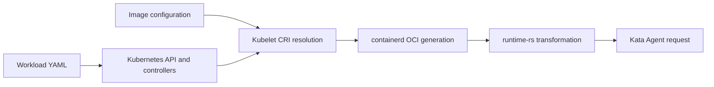
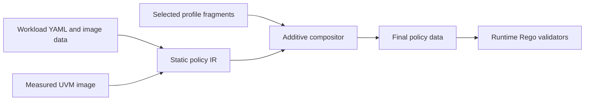

# GenPolicy Rego Fragments

## Status

This document proposes a design for separating workload-static and UVM-static
policy from versioned platform mutations. It does not describe functionality
currently implemented by Kata Agent or GenPolicy.

## Motivation

GenPolicy currently predicts the complete `CreateContainerRequest` that Kata
Agent will receive. That request is not produced directly from workload YAML.
It is the result of a pipeline:



The prediction embeds behavior from specific Kubernetes, containerd, and Kata
versions in GenPolicy. Component upgrades can therefore cause policy drift even
when workload intent has not changed.

The proposed design makes GenPolicy responsible for static workload, image,
and measured UVM constraints. Versioned **Rego fragments** validate mutations
introduced by the platform profile. The name and composition model follow the hcsshim
security-policy fragment design, including fragment identity by issuer, feed,
namespace, and security version number (SVN). The main adaptation is that Kata
fragments validate platform mutations rather than contribute additional
containers.

The hcsshim design provides useful precedents:

- a base policy explicitly authorizes a fragment issuer, feed, minimum SVN, and
  exported content;
- each fragment is isolated in a Rego package namespace;
- fragment framework compatibility is explicit;
- fragment loading fails closed on identity, namespace, or SVN mismatch;
- `platform_rules` can contribute platform-owned environment and mount rules.

See the hcsshim
[`framework.rego`](https://github.com/microsoft/hcsshim/blob/main/pkg/securitypolicy/framework.rego),
[`securitypolicyenforcer_rego.go`](https://github.com/microsoft/hcsshim/blob/main/pkg/securitypolicy/securitypolicyenforcer_rego.go),
and
[`platform_rules.rego`](https://github.com/microsoft/hcsshim/blob/main/pkg/securitypolicy/fragment_test_policies/platform_rules.rego).

## Goals

- Generate exact policy constraints from workload YAML and digest-bound image
  configuration without predicting platform implementation details.
- Assign every platform mutation to one category and one owning fragment.
- Reuse reviewed fragments across workloads with the same measured profile.
- Correlate generated values with static workload intent and with other values
  in the same request.
- Reject unknown fields, unclaimed mutations, fragment overlap, and profile
  mismatch.
- Derive candidate fragments from capture evidence, then require review and
  negative tests before publication.

## Non-goals

- Trusting containerd or runtime-rs merely because a captured request contains
  self-consistent values.
- Automatically proving a safe rule from a finite set of captures.
- Allowing fragments to add arbitrary workload identities, commands, devices,
  storages, environment variables, or mount destinations.
- Treating component version strings as a complete profile identity.
- Supporting arbitrary admission webhooks, CSI drivers, or device plugins
  without including their configuration and evidence in the profile.

## Terminology

Static policy
:   Constraints derived from trusted workload YAML, referenced ConfigMaps and
  Secrets, image configuration bound to a manifest digest, or a measured UVM
  artifact such as the built-in pause container.

UVM-static policy
:   Constraints derived from the measured UVM image and independent of the
  Kubernetes, containerd, and runtime-rs profile. The built-in pause
  executable and its image-derived process identity are UVM-static.

Static policy IR
:   A compiler intermediate representation containing only static policy plus
  stable workload subject identifiers. It deliberately omits every
  profile-owned final-policy field.

Mutation
:   A field addition, default, resolution, rewrite, removal, normalization, or
    generated value between static input and the Agent-visible request.

Fragment
:   A reviewed mutation module that materializes profile-owned final-policy
  constraints at build time and validates the same claims at runtime.

Profile
:   The complete set of component versions, configurations, binaries, and
    operating modes that determine request mutation behavior.

Claim
:   A JSON-pointer path or typed collection role that a fragment exclusively
    owns and must validate.

## Additive Composition Model

The composition operation is purely additive. GenPolicy first emits a static
policy IR with stable subjects derived from workload intent, for example
`container/sidecar`, `container/workload`, or
`sandbox/default/balanced-mode`. These exact IDs are composition handles for
one static base, not reusable fragment selectors. A materialization claim can
add an absent constraint below one of those subjects, but it remains bound to
that static base and cannot replace or delete static data.

A reusable profile fragment instead declares a subject role and a value
template. During composition, the static base lowers that declaration into
exact-subject materialization claims. Lowering must fail when a required role
has no match, a singular role has multiple matches, or a value cannot be
derived from trusted static inputs. The current PoC does not implement this
lowering step, so its exact-subject candidates are reconstruction evidence,
not publishable profile fragments.



The final policy produced by composition is:

$$
P = S \oplus M_1 \oplus M_2 \oplus \dots \oplus M_n
$$

where $S$ is the static IR and each $M_i$ is a set of additions at previously
absent paths. The operator $\oplus$ is defined only when all target subjects
exist, all target paths are absent, and no two fragments claim the same target.
Composition fails otherwise.

This is simpler than applying general JSON Patch or allowing arbitrary Rego to
construct policy data. In particular:

- exact workload subject IDs select containers during materialization; array
  indexes and profile-generated CRI annotations do not;
- reusable fragments select declared roles, which the static base lowers to
  exact workload subjects with explicit cardinality;
- fragment order cannot affect the result when claims are disjoint;
- an addition cannot overwrite a static constraint;
- duplicate, missing, or ambiguous subjects fail composition;
- the final policy contains ordinary policy data and can use the existing
  Agent policy interface.

A platform transformation described as a rewrite is still additive at this
boundary. For example, the static IR omits the host root path and the
runtime-rs fragment adds the final `$(root_path)` constraint. A platform
removal is represented by an absence assertion checked by the fragment; it is
not permission to delete a static constraint. If a purported fragment needs
to overwrite trusted YAML or image data, the mutation classification or trust
boundary is wrong.

## Runtime Authorization Model

Let $P$ be the composed final policy, $Q$ the Agent-visible request, and $F_i$
a fragment validator. Authorization requires the final static constraints and
every selected fragment to agree:

$$
allow(P,Q) = static(P,Q) \land \bigwedge_{i=1}^{n} F_i(P,Q,C)
$$

$C$ contains values bound from the same request, such as sandbox ID, bundle ID,
Pod UID, sandbox name, and namespace. Fragments compose by intersection, not by
union. A fragment cannot make a request valid after static policy rejects it.

Each final request field must be one of:

1. validated directly by static policy;
2. claimed and validated by exactly one fragment;
3. explicitly shared by fragments through a documented dependency; or
4. rejected as unclaimed.

Collections require role-based ownership rather than index ownership. Mounts
are keyed by destination and purpose, environment entries by variable name,
storages by driver and correlated mount point, and namespaces by type. Array
ordering is not a mutation unless the protocol gives ordering semantic meaning.

!!! warning "Fragments are validators, not authorities"
    API server, kubelet, containerd, and runtime-rs are outside the Kata-CC
    trust boundary. A fragment describes the request shape that trusted Agent
    policy permits; it does not make the producing component trusted.

## Mutation Operations

Every claim records one operation. This makes fragment review about a bounded
transformation rather than a complete request template.

| Operation | Meaning | Example |
| --- | --- | --- |
| `default` | Add a fixed value when workload input omits it | OCI version |
| `generate` | Create a deployment-specific value with a bounded grammar | Pod UID |
| `resolve` | Resolve a declared reference against profile state | `fieldRef`, ConfigMap environment |
| `derive` | Compute a value from static input or another bound value | hostname from Pod name |
| `normalize` | Convert representation without changing intent | capabilities compared as a set |
| `rewrite` | Add only the final guest-oriented constraint; the host form is absent from static IR | Kata rootfs path |
| `remove` | Assert that a profile-owned final field is absent; never delete static data | guest Seccomp disabled |
| `envelope` | Add transport metadata around a statically authorized identity | guest-pull driver options |

The fragment manifest records the operation, owned path or role, static anchor,
correlations, evidence, and whether absence is also meaningful.

## Mutation Categories

### Static workload, image, and UVM pause

This category is not a fragment. GenPolicy owns it.

| Data | Treatment |
| --- | --- |
| Manifest digest | Exact |
| Command and arguments | Exact, using Kubernetes image/YAML precedence |
| Working directory | Exact |
| Image and YAML environment | Exact after static precedence resolution |
| UID, GID, and supplementary groups | Exact |
| Capabilities and no-new-privileges | Exact set/value |
| Root read-only state | Exact |
| Volume role and destination | Exact |
| Probe and lifecycle commands | Exact |
| Built-in pause command and process identity | Exact from the measured UVM image |

Static data must not contain containerd-generated root paths, CRI annotations,
host mount paths, or runtime-rs storage objects. It does contain stable subject
IDs and static anchors needed by fragment additions, such as container name,
volume role, destination, image digest, command, and environment-variable name.

The pause container is a special static subject. Kata uses the pause executable
from the UVM image rather than treating the Kubernetes CRI sandbox image as a
workload image pulled into the guest. Its command, executable identity, and
UVM-root relationship are pinned by the measured UVM artifact and do not vary
with Kubernetes, containerd, or runtime-rs versions. The CRI pause image
reference can still appear as sandbox envelope metadata, but it is not
authority for guest code or rootfs content.

Profile fragments may add the sandbox OCI version, generated identity,
annotations, namespaces, mounts, sysctls, cgroup data, and Agent transport
fields. They cannot redefine the pause executable, command, or UVM-root
identity. A UVM image update creates a new UVM-static baseline; it is not a new
containerd or runtime-rs mutation fragment.

The existing containerd 1.7.29 and 2.3.3 captures corroborate this boundary.
Both sandbox requests have command `/pause`, UID and GID `65535`, supplementary
GID `65535`, working directory `/`, no-new-privileges enabled, and a read-only
root. Capture equality is supporting evidence; the measured UVM artifact
remains the authority.

The first static IR prototype derives the following constraints without reading
either generated policy:

- command and arguments using Kubernetes image/YAML precedence;
- image environment plus literal YAML, ConfigMap, and Secret precedence;
- explicit or image working directory;
- explicit no-new-privileges and read-only-rootfs intent;
- probe and lifecycle exec commands; and
- unresolved `valueFrom` declarations as typed `resolve` anchors, not captured
  values.

It rejects image references that are not manifest-digest bound. It does not yet
classify user and group resolution, capability deltas other than explicit final
sets, volume intent, or emit the UVM-static pause subject.

### Kubernetes API and controller fragment

This fragment owns object mutations visible after API admission and controller
reconciliation:

- generated Pod name and UID;
- namespace defaulting;
- Deployment, Job, and other controller-generated Pod identity;
- restart, DNS, scheduler, probe, and termination-message defaults;
- service ClusterIP and assigned service-port values.

Only defaults that influence an Agent request need runtime Rego rules. Other
defaults remain provenance evidence. Generated names and UIDs use bounded
grammars and are bound once for reuse by later fragments.

Admission webhooks are separate fragments because Kubernetes version alone does
not identify their behavior.

### Kubelet resolution fragment

This fragment owns translation from the bound Pod to CRI input:

- `fieldRef`, `resourceFieldRef`, ConfigMap, and Secret environment resolution;
- service-link environment variables;
- Pod hostname;
- termination-message and Kubernetes-managed file mounts;
- resource-to-cgroup calculations;
- Pod security-context projection into OCI user and group fields;
- kubelet-prepared volume sources.

Resolution must remain anchored to static declarations. For example, the
fragment can permit `POD_UID=<bound Pod UID>` but cannot permit an arbitrary
environment variable with a UUID value. Service rules pin the statically
declared Service and port names while allowing only typed endpoint values.

Capturing the CRI boundary between kubelet and containerd is required before
this category can be separated completely from containerd OCI generation.

### containerd OCI fragment

This fragment owns conversion from CRI input to the raw OCI specification:

- OCI specification version;
- CRI annotations;
- sandbox OCI defaults;
- default sysctls, masked paths, read-only paths, capabilities, and resources;
- host-oriented standard mounts;
- cgroup path generation;
- ordering-insensitive normalization of set-like fields.

The fragment must validate absence as well as presence. A version that does not
emit an annotation or sysctl requires that field to remain absent.

The current containerd 1.7.29 and 2.3.3 capture comparison found three stable
differences across five workloads and eleven paired create requests:

| Claim | containerd 1.7.29 | containerd 2.3.3 | Request scope |
| --- | --- | --- | --- |
| OCI version | `1.1.0` | `1.3.0` | Sandbox and containers |
| `io.kubernetes.cri.podsandbox.image-name` | Absent | Exact configured CRI sandbox reference; metadata only | Sandbox |
| Sandbox sysctls | Absent | `ip_unprivileged_port_start=0` and `ping_group_range=0 2147483647` | Sandbox |

Capability, environment, and mount ordering differed but their semantic sets
did not. Generated IDs, ClusterIPs, CNI paths, and Kata path hashes are not
containerd-version claims.

#### CRI/containerd role promotion

The coverage prototype has a reviewed allowlist for profile claims that may be
lowered to container roles. It currently promotes:

| Claim | Role | Value model | Why reusable |
| --- | --- | --- | --- |
| `/OCI/Version` | `all` | Exact profile constant | The selected containerd profile emits one OCI version for every subject |
| `io.kubernetes.cri.container-type` | `application` | Exact value `container` | The value identifies the already selected static application role; it does not select a workload identity |
| `io.kubernetes.cri.container-type` | `sandbox` | Exact value `sandbox` | The value identifies the measured pause role |

Promotion requires at least one subject in the role, complete coverage of every
subject in that role, one canonical value, one operation, and one evidence
class. The two container-type claims additionally require the exact reviewed
role value. A partial capture or unexpected value remains exact-subject
materialization and therefore blocks a reusable-fragment result.

Other repeated CRI/containerd fields are not profile constants:

- sandbox ID, Pod UID, and generated Pod name need parameterized role rules
  with bind-once correlation;
- namespace must equal the static workload namespace or reviewed API default;
- log directory must be derived from the bound namespace, generated Pod name,
  and Pod UID rather than independently accepted or bound as an opaque path;
- container name and image name remain exact static-subject data;
- cgroup paths and resources derive from Pod QoS and per-container resources;
- capabilities, masked paths, read-only paths, namespaces, and standard mounts
  depend on security context, host namespace settings, DNS mode, privileges,
  and volume intent; and
- CNI paths and Kata guest paths belong to their owning CNI or runtime-rs
  fragments, not the containerd profile.

The profile may fan a parameterized identity validator out to every application
container, but it must not publish the captured identity value or a free-standing
regex as a reusable claim.

The current runtime-binding prototype implements this Pod-identity subset:

| Fact | PoC status | Behavior |
| --- | --- | --- |
| Sandbox ID | Implemented as the binding key | The sandbox request grammar-checks it; an application request with another ID cannot select the stored binding |
| Pod UID | Implemented as the bound value | The sandbox request stores it once; later application requests require exact equality |
| Generated Pod name | Implemented as a bound value | Trusted static context supplies an anchored exact-name or `generateName` pattern; the sandbox request binds the matching name and later application requests require equality |
| Namespace | Implemented as a static anchor and bound value | The request must equal the static workload namespace or reviewed default before the sandbox stores it in the tuple |
| Sandbox log directory | Implemented as a derivation | Every request must equal `/var/log/pods/<bound-namespace>_<bound-name>_<bound-uid>`; the host-provided path is never stored as an independent fact |

The binding value is the tuple `{pod_uid, pod_name, pod_namespace}` keyed by
sandbox ID. Tests mutate each tuple component, the static Pod-name pattern, the
static namespace, and the derived log path independently.

### runtime-rs fragment

This fragment owns the raw-OCI to Agent-request transformation:

- root path rewrite to `/run/kata-containers/<bundle-id>/rootfs`;
- PID, network, IPC, UTS, mount, and cgroup namespace normalization;
- host mount source rewrite into Kata guest-visible domains;
- `/dev/shm` rewrite to `/run/kata-containers/sandbox/shm`;
- Kata bundle and container-type annotations;
- Agent `Storage` and `Device` construction;
- `shared_mounts` and `sandbox_pidns` request fields;
- Seccomp removal when enabled by trusted Kata configuration, paired with an
  explicit final-request absence rule.

Root paths, storage mount points, and bundle annotations must bind the same
bundle ID. Sandbox-scoped mount and storage paths must bind the same sandbox ID.
The fragment rejects internally consistent but statically unanchored identities.
The current upstream Rego does not enforce sandbox Seccomp absence in the
captured profile, so that observed removal remains an uncovered candidate, not
an implemented fragment claim.

#### Runtime-rs dependency on static policy

Runtime-rs rules are **not generally independent of static policy**. The
runtime-rs fragment owns the transformation mechanism and its configuration,
but most transformed values consume workload/image intent, a static role, or a
previously bound identity. Reuse means applying the same typed transformation
to different static inputs; it does not mean publishing captured output as a
profile constant.

| Runtime-rs behavior | Dependency class | Required static or bound input | Reusable rule shape |
| --- | --- | --- | --- |
| Bundle annotation and guest root path | Bound identity plus static rootfs identity | Exact workload subject, image/rootfs mode, bound bundle ID | Require one bundle ID across annotation, root path, rootfs storage, and mounts |
| Container-type annotation | Static role | Application, sandbox, or explicitly modeled single-container role | Add the exact annotation value selected by the static role |
| PID/network/time namespace normalization | Static Pod namespace intent plus runtime profile | Host namespace and shared-PID declarations | Remove paths/types only for the reviewed profile branch and require the expected final namespace set |
| Mount-source rewrites | Static volume role and destination plus bound IDs | Declared volume, destination, access mode, Pod/sandbox ID, bundle ID | Rewrite only the source representation; preserve exact destination and volume semantics |
| `/dev/shm` rewrite | Static/default mount role plus UVM capability | Whether the Pod receives the shared-memory mount | Require the fixed UVM source and destination only for selected subjects |
| Rootfs and volume `storages` | Static image/volume identity plus storage profile | Manifest digest or root hash, volume type, destination, access mode, encryption requirement | Construct the profile-specific envelope around exact static identity |
| Agent `devices` and VFIO filtering | Static device intent plus runtime/device profile | Declared device or resource, container path, count, VFIO mode | Preserve the authorized device set while translating transport identity |
| Resource update and unsupported-field clearing | Static resource intent plus guest capability | CPU/memory constraints, Pod QoS, fields enforced outside the guest | Validate the derived final values and permit absence only for explicitly delegated fields |
| `shared_mounts` | Trusted runtime configuration plus static container identity | Exact source/destination container names and paths | Select configured entries by the static subject; never expose the whole profile list to every container |
| `sandbox_pidns` | Static Pod sharing intent | `hostPID` or shared-process-namespace semantics | Derive one exact boolean for the selected Pod profile |
| Seccomp or SELinux removal | Static security intent plus trusted runtime configuration | Workload security profile and an explicit static capability permitting guest omission | Assert final absence only when both static capability and profile configuration authorize it |
| Passfd I/O ports | Runtime-generated request envelope plus static I/O mode | Whether stdin/stdout/stderr and terminal are enabled | Bind generated ports to the exact process channels; do not authorize arbitrary ports profile-wide |

Only the **mechanism side** of some rules is profile-only: fixed path templates,
annotation keys, namespace-normalization algorithms, supported storage drivers,
and configuration-selected absence behavior. Their application still requires
static predicates or bound parameters. A reusable runtime-rs fragment therefore
declares consumed static capabilities such as `rootfs`, `volume:<role>`,
`device:<role>`, `pod-pidns`, `container-identity`, and
`allow-guest-seccomp-absence`. The compositor fails if the selected static base
does not export a required capability.

This boundary prevents a fragment from converting a workload-independent
runtime setting into new workload authority. In particular:

- a path grammar cannot authorize an undeclared volume or rootfs;
- a storage driver cannot substitute another image digest or root hash;
- a device translation cannot add an undeclared device;
- a configured shared mount cannot target a different static container; and
- `disable_guest_seccomp=true` cannot silently erase a workload security
  requirement unless the static policy explicitly selected that enforcement
  model.

The current coverage prototype does not yet encode these consumed-capability
dependencies. Its `runtime-rs` and `runtime-rs-envelope` labels establish
provisional transformation ownership, not static independence or publishable
fragment scope.

### Rootfs and storage-mode fragment

Storage behavior merits a separate fragment because it depends on trusted Kata
configuration and snapshotter artifacts, not only runtime-rs version:

- guest pull: exact workload manifest digest; the built-in pause root remains
  UVM-static and is not authorized by a CRI image reference;
- EROFS/dm-verity: exact root hash, layer identity, driver, and options;
- shared filesystem: source constrained to the configured shared domain;
- `shared_fs = "none"`: Agent-local disk `emptyDir` fallback;
- encrypted block `emptyDir`: encryption options and device correlation;
- plain block `emptyDir`: explicit opt-in and exact unencrypted shape;
- memory `emptyDir`: exact tmpfs storage shape;
- ConfigMap, Secret, downward API, and projected-volume copy-to-guest rewrites.

This category consumes static volume intent but cannot change volume role,
destination, access mode, or encryption requirement.

### Generated identity and correlation framework

Generated identities are shared facts, not an independent source of
authorization. The common framework binds each value once and fragments reuse
it:

| Fact | Constraint |
| --- | --- |
| Bundle/container ID | Bounded hexadecimal ID extracted from the Kata root path or bundle annotation |
| Sandbox ID | Bounded hexadecimal ID from CRI annotation |
| Pod UID | UUID grammar bound to API evidence |
| Sandbox name | Controller grammar anchored to static workload name |
| Namespace | Static namespace or API default |
| Node name | Profile-bound or explicitly parameterized value |
| CNI namespace | Anchored profile path with bounded identifier |

Independent regular expressions for repeated identities are forbidden because
they lose relational integrity.

## Fragment Format

A fragment has one claim manifest used by both compiler-time materialization
and runtime validation. The materializer is deliberately data, not executable
Rego, so its write capability is constrained to adding declared values at
absent paths. Runtime Rego uses the same claims to validate the request.

```json title="containerd-2.3.3.fragment.json"
{
  "schema_version": 1,
  "category": "containerd-oci",
  "claims": [
    {
      "operation": "default",
      "target": {
        "scope": "container",
        "role": "all",
        "cardinality": "all",
        "path": "/OCI/Version"
      },
      "value": "1.3.0"
    }
  ]
}
```

Every reusable claim explicitly selects one of two scopes. `scope: policy`
targets policy data outside every container and forbids `role` and
`cardinality`. `scope: container` requires a role of `all`, `application`, or
`sandbox` and a cardinality of `all` or `one`. Cardinality `all` applies the
claim to every matching static subject and requires at least one match;
cardinality `one` requires exactly one match. Missing or ambiguous required
roles fail composition.

The container role above is a reusable declaration, not a literal subject ID.
For a particular static base, the compositor lowers it to exact subjects and
then performs overlap and overwrite checks. Reusable profile fragments reject
exact `subject` targets. Values that depend on workload names, image data, or
generated correlations remain exact-subject materialization claims until a
reviewed typed parameter rule can derive them safely.

The corresponding namespaced Rego exports metadata plus validators:

```rego title="containerd-2.3.3.rego"
package kata_fragment_containerd_2_3_3

fragment := {
    "framework_version": "0.1.0",
    "category": "containerd-oci",
    "issuer": "did:web:profiles.katacontainers.io",
    "feed": "kubernetes-1.33/containerd-2.3.3/linux-amd64-cgroup-v2",
    "svn": "1",
    "profile_identity": "sha256:<canonical-profile-hash>",
    "claims": data.fragment_claims,
}

validate(static, request, context) := {"allowed": true} if {
    request.OCI.Version == "1.3.0"
    allow_sysctls(request)
    allow_pause_annotation(static, request, context)
}
```

Issuer, feed, and minimum SVN adoption follows hcsshim. The base policy lists
the exact fragments it accepts:

```rego title="static-policy.rego"
fragments := [
    {
        "issuer": "did:web:profiles.katacontainers.io",
        "feed": "kubernetes-1.33/containerd-2.3.3/linux-amd64-cgroup-v2",
        "minimum_svn": "1",
        "category": "containerd-oci",
        "profile_identity": "sha256:<canonical-profile-hash>",
    },
]
```

The exact signing and distribution mechanism is independent of the mutation
taxonomy. A COSE envelope and transparency receipts can be added without
changing fragment validator semantics.

## Profile Identity

A fragment feed is readable metadata, not sufficient compatibility proof.
Composition binds two different identities:

Static base identity
:   Hashes the trusted workload inputs, digest-bound workload images, measured
    UVM image, and built-in pause artifact.

Mutation profile identity
:   Hashes only the components, configurations, and operating modes that can
    affect the selected fragment claims.

Separating them permits one reviewed containerd fragment to be reused across
UVM images when its claims do not depend on UVM content. A fragment declares
any static-base capability it consumes; a rootfs/storage fragment may depend on
UVM facilities even though a containerd OCI fragment does not. The composition
manifest binds both identities and rejects an undeclared dependency.

Across the selected fragments, mutation profile identities cover at least:

- Kubernetes, kubelet, containerd, runtime-rs, runc, CNI, and Agent versions;
- kubelet, containerd, Kata, CNI, and policy-framework configurations;
- architecture, cgroup mode, rootfs mode, and snapshotter;
- capture backend and request-authority implementation;
- enabled admission, controller, CSI, and device-plugin fragments;
- hashes of binaries and configuration artifacts used to derive the fragment.

The existing appliance `profile.json` and capture manifest provide the initial
canonicalization and artifact hashes.

## Composition And Conflict Rules

1. Each required category has exactly one selected fragment unless the category
   explicitly supports sub-fragments.
2. A claim has one owner. Duplicate claims fail composition.
3. Dependencies are explicit. For example, runtime-rs may consume a bundle ID
   bound by the common framework but cannot redefine it.
4. Static fields cannot be claimed by fragments.
5. A materialized claim only adds an absent path. Replace and delete operations
  are not part of the fragment format.
6. Unknown fields and unclaimed collection elements fail closed.
7. Missing required fragments, profile hash mismatch, unsupported framework
   versions, and SVN rollback fail before workload execution.

Composition produces a claim ledger that is retained beside the policy:

```json title="fragment-claims.json"
{
  "schema_version": 1,
  "claims": [
    {
      "category": "containerd-oci",
      "operation": "default",
      "path": "/OCI/Version",
      "fragment": "kata_fragment_containerd_2_3_3",
      "evidence": ["raw-oci/container.config.json"]
    }
  ]
}
```

The ledger also records the static subject ID and a digest of the materialized
value. This permits an auditor to reproduce composition without executing the
runtime validator.

## Executable Design Check

The compositor prototype lives in
`src/tools/genpolicy/appliance/scripts/compose_policy_fragments.py`, with tests
in `src/tools/genpolicy/appliance/tests/test_compose_policy_fragments.py`. It
uses the checked-in `run-complex` policy compiler output as a golden result.

The original test removed representative containerd and runtime-rs fields from
the compiler result. It remains a focused composition test, while
`prototype_fragment_coverage.py` now exercises an independently generated
static IR. The compositor demonstrates:

- complete expected-policy comparison with fail-closed missing-leaf detection;
- selectors that remain correct after subject-array reordering;
- semantic environment composition by variable name;
- typed normalization of environment, capability, and regex collections;
- non-materializing required-absence assertions;
- rejection of duplicate or overlapping parent/child claims;
- rejection when an addition would overwrite static data; and
- rejection of an unknown subject.

This proves the additive composition mechanics without Agent changes. The
coverage prototype additionally separates policy-data reconstruction from
runtime-request absence coverage; success at the first cannot hide a gap in the
second.

### Runtime binding prototype

`src/tools/genpolicy/appliance/scripts/prototype_fragment_bindings.rego`
demonstrates bind-once, correlate-later authorization without Agent changes. It
uses the existing Agent metadata response contract: an allowed policy decision
may return JSON Patch operations which the Agent applies to `data.pstate` before
the next request.

The prototype binds a Pod identity tuple when the sandbox-role
`CreateContainerRequest` arrives. `CreateSandboxRequest` cannot perform this
step because it does not carry OCI Pod annotations. The binding key includes
the bounded sandbox ID. The value contains the bounded Pod UID, generated Pod
name anchored by trusted static context, and namespace already checked against
static workload intent or the reviewed default. Subsequent application-role
requests are allowed only when the sandbox ID selects that binding and the
complete tuple is exactly equal.

The sandbox log directory is not another first-seen binding. The validator
reconstructs `/var/log/pods/<namespace>_<name>_<uid>` from the validated request
tuple and requires exact equality on every sandbox and application request.
This rejects a different but syntactically valid identity and a path that is
well-formed but refers to another Pod.

Focused tests in
`src/tools/genpolicy/appliance/tests/fragment_bindings_test.rego` cover:

- the first sandbox request returning one `add` operation;
- idempotent replay of the same sandbox binding;
- an application container matching the binding;
- denial before the sandbox binding exists;
- denial of a different valid Pod UID;
- denial of a different valid generated Pod name;
- denial of a Pod name outside the static name pattern;
- denial of a namespace outside static context;
- denial of a log directory not derived from the identity tuple;
- denial when a binding belongs to another sandbox; and
- denial of malformed identities.

No explicit destroy operation is required for the current protocol. One Agent
serves one sandbox, `DestroySandboxRequest` is empty, and destroying the sandbox
terminates the Agent with its in-memory policy state. Supporting multiple
sandbox lifecycles in one Agent would require an authenticated lifecycle key
and explicit state removal.

This prototype does not load fragments into the production policy. Integration
still needs the base policy to invoke each selected namespaced validator,
intersect its `allowed` result, and concatenate non-conflicting state operations
into the final metadata response. It does not require a new Agent RPC or a
change to the Agent's policy-state implementation.

#### Legacy GenPolicy binding experiment

The same state mechanism also tightens Legacy GenPolicy independently of
fragment loading. Legacy already returned state operations for container IDs,
sandbox name, namespace, and network namespace, but it evaluated sandbox ID and
Pod UID patterns independently on each `CreateContainerRequest`. A later
container could therefore present another syntactically valid Pod identity
unless some unrelated path happened to correlate it.

The experiment adds one `pod_identity.<sandbox-id>` state entry containing
`{pod_name, pod_namespace, pod_uid}`. The operation is returned only after the
complete Legacy container rule succeeds. Later requests carrying the same
sandbox ID must equal the complete stored tuple. For sandbox requests that
carry Pod UID, the log directory must also equal
`/var/log/pods/<namespace>_<name>_<uid>` exactly rather than merely matching an
independent UUID regex.

Unlike the fragment prototype, the Legacy compatibility path permits the first
fully authorized container request to establish the tuple. Existing Legacy
tests include isolated application requests and older request shapes that do
not model sandbox-first sequencing. Requests without `sandbox-uid` bind
`pod_uid: null` and still correlate sandbox ID, name, and namespace; the
existing Legacy log-directory pattern remains their fallback. A future strict
mode can require sandbox-first binding after callers and fixtures guarantee
that lifecycle.

Focused OPA tests cover first bind, exact application reuse, denial of a
different valid UID, generated name, or namespace, exact sandbox log-directory
derivation, and the UID-absent compatibility branch. The production Rego suites
pass with the rule enabled. The stateful Regorus `AgentPolicy` test also passes,
as do the generated-name, network-namespace, ConfigMap-volume, and
container-image-volume Legacy fixtures that contain allowed UID-absent
requests. The emptyDir fixture currently fails before request evaluation due to
an unrelated pre-existing `allow_block_storage` multiple-output error in the
available test binary.

### Independently generated static slice

A second prototype in
`src/tools/genpolicy/appliance/scripts/prototype_static_policy.py` generates a
sparse static IR directly from capture-bundle `workload.yaml` and digest-bound
image configuration. It does not read Legacy or request-derived policy while
generating constraints. It then compares those constraints with both policy
outputs and uses the bundle only for mutation provenance.

The generator also accepts a separately measured UVM baseline through a strict
allowlist. It adds the pause command, environment, user, working directory,
no-new-privileges, root path relationship, and read-only root without reading a
containerd capture. The checked local containerd 1.7.29 and 2.3.3
complex-workload bundles produced the following result:

| Measurement | containerd 1.7.29 | containerd 2.3.3 |
| --- | ---: | ---: |
| Workload/image static constraints generated | 9 | 9 |
| UVM-static pause constraints generated | 7 | 7 |
| Matching Legacy constraints | 9 | 9 |
| Matching request-derived compiler constraints | 16 | 16 |
| Unresolved `valueFrom` anchors retained | 3 | 3 |

The constraints cover two workload containers. They include arguments,
environment subsets, working directories, no-new-privileges, and exec commands.
The result is evidence that these fields can move out of profile-specific
generation without changing either policy implementation.

### Complete candidate reconstruction

`prototype_fragment_coverage.py` builds sparse subjects only from the
independent static IR, derives a materialization claim for every remaining
final policy-data leaf, and invokes the compositor with the compiler policy as
an oracle. The expected policy supplies no static value. Environment entries
are keyed by name in the composition IR and materialized back to OCI arrays.

Both checked profiles reconstruct canonically:

| Measurement | containerd 1.7.29 | containerd 2.3.3 |
| --- | ---: | ---: |
| Static owned roles | 21 | 21 |
| Candidate claims, total | 136 | 136 |
| Candidate profile fragment claims | 38 | 38 |
| Workload-bound materialization claims | 98 | 98 |
| Ambiguous kubelet-or-containerd claims | 70 | 70 |
| Exact canonical reconstruction | Pass | Pass |

The `21` static roles count environment variables and the two workload-declared
container-name annotations individually, unlike the earlier `16`
constraint-object comparison. Candidate categories in each run are `70`
kubelet-or-containerd, `3` kubelet resolution, `37` policy-framework
settings, `11` runtime-rs rewrites, and `15` runtime-rs envelope claims. Of the
`37` global policy claims, the empty service-environment allowlist is a
profile security default. One additional profile claim applies OCI version to
all container roles, replacing three exact-subject claims. One static-base
materialization claim applies the same `16` exact Service environment names to
all application containers and excludes the sandbox. The generator emits this
role claim only when every application container has the same canonical regex
set, operation, and evidence; otherwise it retains exact per-container claims.
In total, `98` claims prove exact materialization for this static base but are
not reusable fragments.

### Repeated claim fan-out

Repeated exact-subject claims do not all have the same ownership. The complex
workload contains two application containers and one sandbox. Its `42` repeated
or singular claim paths divide as follows:

| Target population | Identical values | Subject-specific values |
| --- | ---: | ---: |
| All subjects | 15 | 8 |
| All application containers | 10 | 0 |
| All sandboxes | 4 | 0 |
| One subject | 4 | 0 |

The profile fragment should describe the fan-out mechanism, while trusted
workload or pod inputs supply its parameters:

- Kubernetes service-link environment variables are injected into both
  application containers, not the sandbox. The two containers receive the
  same `16` service variables in this capture. Service names come from the
  submitted Service objects, while addresses and ports come from cluster
  state; neither is a profile constant.
- ConfigMap, Secret, and downward-API variables occur only on the `workload`
  container because only that container declares `envFrom` and `env` entries.
- `HOSTNAME` is a pod-wide kubelet value repeated in both application
  containers. It is a common fan-out rule parameterized by pod identity.
- The base `/proc`, `/dev`, `/dev/pts`, `/dev/mqueue`, and `/sys` mounts are
  containerd defaults. Application containers additionally receive cgroup and
  pod-file mounts. The termination-log destination is workload-configurable
  and its host source is container-specific before runtime normalization.
- Sandbox mounts form a separate role. They share some destinations with
  application containers but do not have the same complete mount value.

Consequently, deduplicating repeated claims by value alone is unsafe. Reusable
fragments need typed role rules such as `all-application-containers` and
`all-sandboxes`, plus workload-derived parameters for service names, pod
identity, volume intent, and per-container paths. The generated report records
`target_population`, `distinct_values`, and `value_shape` for every
exact-subject path so this distinction is auditable.

!!! warning "Service environment authorization is container-scoped"
    Legacy `allow_env_regex` patterns accept the shape of any Kubernetes
    service variable. An attacker who can influence a Service name can thereby
    introduce a new environment name that changes application behavior.
    Anchoring a captured service name is necessary but still insufficient when
    that regex is global: a name intended for one container would also be
    authorized for every other container.

    The request-derived compiler clears the inherited global service patterns
    and writes anchored, typed patterns to the selected container's
    `OCI.Process.EnvRegex`. Rego evaluates those patterns only after selecting
    that container. The sandbox has no `EnvRegex`, and the global
    `CreateContainerRequest.allow_env_regex` remains empty. Tests reject both
    an attacker-chosen service-shaped name and a captured name presented to a
    different container.

### Other Kubernetes mutations and application-role reuse

Assume that generated regular expressions are fully anchored, bounded, and
safe from grouping or engine-semantics errors. That fixes syntax matching, but
it does not make two syntactically valid values security-equivalent. A reusable
rule for all application containers must also preserve workload declarations,
bind pod-wide identities once, and correlate every later occurrence with that
binding.

The current mutation inventory has no additional Kubernetes value that is safe
as an independent "accept this grammar for every application container" regex.
It does contain pod-wide values whose *first occurrence* can be grammar-checked
and bound, then reused exactly across a role. It also contains fixed structural
defaults that should be expressed as exact role rules rather than regex.

| Mutation | Regex treatment | All application containers? | Required authorization model |
| --- | --- | --- | --- |
| Generated Pod UID | A UUID grammar may validate the bind step only | Correlate wherever the profile emits the UID | Bind one UID to the static Pod subject, then require exact equality in annotations, environment, log paths, and storage paths |
| Controller-generated Pod name | A bounded DNS-name grammar and static `generateName` prefix may validate the bind step | Correlate wherever the generated name is emitted | Bind one generated name to the workload subject; do not allow any DNS-valid name |
| Pod hostname and `HOSTNAME` | Do not use a free-standing hostname regex | Only when the profile injects it into every application container | Derive the value from the bound Pod name or exact `spec.hostname`, then fan out that exact value |
| Namespace and node name | No generic regex; both select administrative or scheduling context | Only fields that the platform actually emits | Use the exact default or workload namespace and the selected, profile-authorized node identity |
| CRI Pod annotations | Grammars may validate encoded IDs, not authorize new identities | Common annotation keys may use an application-role template | Require each annotation value to equal the already bound Pod, sandbox, container, namespace, or workload value |
| `fieldRef` environment | No generic value regex | Only containers that statically declare that `fieldRef` | Resolve the declared field from bound Pod data and add the exact name/value to those subjects |
| `resourceFieldRef` environment | Numeric syntax alone is insufficient | Only the declaring container | Derive the exact value from that container's static resource request/limit and divisor |
| ConfigMap and Secret environment | No regex for names or values | Only containers with the corresponding `env` or `envFrom` declaration | Bind the declared object/key and exact resolved content, or a trusted content digest; preserve precedence per container |
| Kubernetes-managed `/etc/hostname`, `/etc/hosts`, and `/etc/resolv.conf` mounts | A path regex is insufficient | A structural rule may target the application role when the DNS/profile predicate requires the mount | Keep fixed destinations and options exact; bind each source to the same Pod/sandbox and selected DNS mode |
| Termination-log mount | A bounded container-ID grammar may validate one component only | Usually repeated, but parameterized per container | Keep the destination exact from workload/default intent and derive the source from the bound Pod and exact container identity |
| Kubelet-prepared volume sources, including projected and downward-API data | No generic source or destination regex | Only containers mounting the statically declared volume role | Select by exact volume role and destination, then correlate the generated source with Pod UID, volume identity, and storage object |
| Resource-to-cgroup calculations | Not a regex problem | Values are container- and Pod-QoS-specific | Validate the arithmetic relationship to static requests/limits and Pod aggregate state |
| Security-context projection | No regex | Shared values may be lowered to a role rule only when every selected subject has the same static intent | Keep user, group, capability, privilege, and no-new-privileges constraints exact and statically anchored |
| Probe and lifecycle commands | No regex | Only the container declaring the command | Keep exact in static policy; platform defaulting must not broaden executable or argument selection |
| Restart, scheduler, DNS, and termination defaults not represented in an Agent request | No runtime regex or fragment claim | Not applicable | Retain as provenance and use them only to derive an Agent-visible constrained field |

The safe reusable abstraction is therefore a **parameterized application-role
rule**, not a role-wide regex list. For example, a fragment may state that each
selected application container receives a `HOSTNAME` equal to
`$(bound-pod-hostname)`, or a standard `/etc/hosts` mount whose source contains
`$(bound-sandbox-id)`. Lowering substitutes bindings from the static base and
produces exact-subject claims. It must fail if a required declaration, binding,
or profile predicate is absent.

This gives three promotion classes:

1. **Exact profile constants:** apply to a role directly without regex, such as
   a fixed OCI version or a fixed mount option set.
2. **Bound pod-wide parameters:** validate and bind once, then require equality
   across selected application containers.
3. **Subject-specific resolutions:** retain per-container or per-volume
   materialization because static declarations or authority differ.

Using one independent regex evaluation per container belongs to none of these
classes: it permits different syntactically valid identities in requests that
should describe the same Pod. Cross-container equality and static anchoring
are mandatory even when the regex grammar itself is correct.

After typed set normalization, only three claims differ between profiles: OCI
version for the sandbox and two workload containers, from `1.1.0` to `1.3.0`.
Capability and service-environment regex order differences are not mutations.

The CLI writes its report and exits nonzero by default while ownership or
absence coverage is incomplete. `--allow-incomplete` permits candidate
generation but leaves the report result as `incomplete`.

### Coverage report format

`fragment-coverage.json` is an experimental evidence report emitted by
`prototype_fragment_coverage.py`. It is not the publishable fragment manifest
described in [Fragment Format](#fragment-format). Consumers must check
`schema_version` and the top-level `result`; reconstruction success alone does
not mean the candidate set is complete or reusable.

```json title="fragment-coverage.json"
{
  "schema_version": 1,
  "result": "incomplete",
  "blockers": ["..."],
  "binding": {},
  "coverage": {},
  "fragments": [],
  "ledger": [],
  "materialization_sets": [],
  "request_absence_coverage": {},
  "static_policy": {}
}
```

| Field | Meaning |
| --- | --- |
| `schema_version` | Report schema version. Version `1` is the only supported value. |
| `result` | `pass` only when every completeness gate is satisfied; otherwise `incomplete`. |
| `blockers` | Human-readable reasons why `result` is not `pass`. |
| `binding` | Profile, static-base, and measured-UVM identities used to bind the evidence. |
| `coverage` | Reconstruction counts, ownership status, portability counts, limitations, and fan-out analysis. |
| `fragments` | Profile-only candidate fragments. Exact workload subjects are forbidden in this array. |
| `ledger` | Flattened ownership record for every static, fragment, and materialization claim. |
| `materialization_sets` | Reconstruction-only claims that depend on exact workload subjects or workload-derived values. |
| `request_absence_coverage` | Coverage of fields observed to be removed before the final Agent request. |
| `static_policy` | Sparse independently generated policy used as the composition base. |

The `binding` object contains:

| Field | Meaning |
| --- | --- |
| `profile_identity` | SHA-256 identity from the capture profile. |
| `static_base_digest` | SHA-256 digest of the canonical independent static IR. |
| `profile_uvm_digest` | UVM digest declared by the capture profile, or `null` when absent. |
| `uvm_artifacts` | Measured UVM artifacts consumed by static subjects. |
| `uvm_bound` | Whether the profile UVM digest matches one of those measured artifacts. |

The `coverage` object separates different proof obligations:

- `reconstruction` records whether static policy plus all candidate claims
  canonically equals the compiler policy.
- `status` is `materialization-only` while any claim depends on exact workload
  subjects or values. `experimental` means no such dependency was found; it
  does not override other completeness blockers.
- `static_claims`, `candidate_claims`, `candidate_fragment_claims`,
  `materialization_claims`, and `categories` count each ownership class and
  candidate claims by provisional component owner.
- `reusable_profile_claims`, `workload_bound_materialization_claims`, and
  `workload_derived_global_claims` classify candidate portability.
- `ambiguous_boundary_claims` counts claims that cannot yet be assigned between
  kubelet and containerd because the CRI boundary was not captured.
- `required_absence_claims` counts declared final-request absence claims.
- `limitations` records known implementation gaps independently of observed
  blockers.
- `subject_fanout` groups exact-subject claims by path. Each entry contains
  `path`, `claim_count`, `subjects`, `categories`, `evidence`,
  `target_population`, `distinct_values`, and `value_shape`. A value shape of
  `identical` means canonical JSON values match; it does not by itself prove
  that the value is profile-owned.

Each entry in `fragments` has `schema_version`, `category`, `scope`,
`profile_identity`, and `claims`. Its scope is always `profile`; every target
explicitly selects either `policy` or `container` scope, and no target embeds
an exact workload subject. Profile fragments do not carry
`static_base_digest`. Exact-subject claims remain in `materialization_sets`
until role-selector and parameter lowering can turn them into reusable
declarations. Materialization sets additionally carry the exact
`static_base_digest` and use
`scope: static-base-materialization`. Each claim has the following shape:

```json title="Candidate claim"
{
  "evidence": "missing-kubelet-CRI-boundary",
  "operation": "default",
  "scope": "static-base-materialization",
  "target": {
    "subject": "container/workload",
    "path": "/OCI/Process/Terminal"
  },
  "value": false
}
```

`target.path` is a JSON pointer relative to the selected scope or subject.
Reusable claims use explicit `target.scope`; exact `target.subject` is valid
only in static-base materialization evidence. Candidate operations are semantic
ownership labels such as `default`, `resolve`, `rewrite`, and `envelope`;
composition remains additive. A `remove` claim is an absence assertion and
therefore has no `value`.

The `ledger` repeats claims in a flat audit form with `owner` set to `static`,
`fragment`, or `materialization`. Entries record `category`, `evidence`,
`operation`, `path`, and `subject`; non-static entries also record `scope`. For example,
`io.kubernetes.cri.container-name` appears only as `owner: static` with
`evidence: trusted-workload-yaml`.

`request_absence_coverage` contains `inventory`, `observed`, `covered`,
`uncovered`, and `entries`. Each entry identifies the subject, path, capture
evidence, and `covered` or `uncovered` status. Covered entries additionally
identify the owning category and rule evidence.

Finally, `static_policy` contains root `policy_data`, bound identities, and
`subjects`. A subject has a stable `id`, output `ordinal`, sparse `policy`, and
`collection_encodings`. The latter records typed intermediate encodings such
as `env-map`; materialization converts them back to the final OCI collection
shape.

Each candidate fragment and materialization set carries the capture profile
identity. Only materialization sets carry the canonical digest of the complete
static IR, including its measured UVM artifact. The compositor requires every
profile identity to match and every materialization set to match the static
base before applying claims. Exact static-base binding is appropriate for
reconstruction evidence, but it is also why materialization sets cannot be
distributed as cross-workload fragments. A reusable fragment binds the
mutation profile and declares only the static capabilities its role selectors
and templates consume. Current capture profile manifests do not contain
`UVM_IMAGE_DIGEST`, so the measured UVM input cannot yet be bound back to the
captured profile and remains an explicit blocker.

### Kubernetes version profile evidence

The Kubernetes stable release channel reported `v1.36.3` on August 6, 2026.
The profile experiment compares it with `v1.33.13`, holding containerd
`v2.3.3`, runc `v1.2.8`, etcd `v3.5.21`, CNI plugins `v1.7.1`, workload and
image inputs, runtime-rs, rootfs mode, and configuration constant. Both cells
were rebuilt from the same source tree so compiler or settings changes could
not be misattributed to Kubernetes.

| Measurement | Kubernetes 1.33.13 | Kubernetes 1.36.3 |
| --- | ---: | ---: |
| Policy-matrix workloads | 5/5 pass | 5/5 pass |
| Request-derived policy replays | 13/13 pass | 13/13 pass |
| Legacy policy replays | 13/13 pass | 13/13 pass |
| Static owned roles, complex workload | 21 | 21 |
| Candidate claims, complex workload | 136 | 136 |
| Candidate profile fragment claims, complex workload | 38 | 38 |
| Workload-bound materialization claims, complex workload | 98 | 98 |
| Ambiguous kubelet-or-containerd claims | 70 | 70 |
| Exact canonical reconstruction | Pass | Pass |
| Observed runtime absences covered | 3/4 | 3/4 |

The controlled materialization reports have identical claim identities and
values. This supports the current additive decomposition for the exercised
workloads: the Kubernetes update did not require a static overwrite, claim
removal, or new mutation claim. It does not establish reusable fragment
completeness because additional role and parameter lowering, the kubelet CRI
boundary, measured UVM binding, and sandbox Seccomp absence rule remain
unresolved.

The secured service-environment policy was also rebuilt from the Kubernetes
`1.36.3` complex-workload capture and replayed against all five stored Agent
requests: three `CreateContainerRequest` and two `ExecProcessRequest` messages.
All five were authorized. Exact comparison with the preceding policy found no
unrelated semantic change: the global service-environment allowlist became
empty, each application container gained its own `16` anchored `EnvRegex`
entries, and the sandbox remained unchanged.

For these controlled profiles and workloads, the additive hypothesis is
therefore **not falsified**: composition required no overwrite or deletion of
trusted static data, claim order did not alter canonical output, complete
policy-data reconstruction passed, and the reconstructed secured policy
authorized every captured request. This is a bounded experimental conclusion,
not proof of universal additivity or publishable fragment completeness. The
unresolved completeness conditions listed above still apply.

The first 1.36 run also demonstrated why a profile is more than component
version labels. Its environment file was present, but its companion Legacy
settings patch was initially missing. Legacy therefore used the global OCI
`1.1.0` default while the captured sandbox request used OCI `1.3.0`, and exact
version comparison denied the first request. Adding the same OCI `1.3.0`
settings patch used by the controlled 1.33 baseline restored all Legacy
replays. Profile validation now requires the two companion settings documents
to be semantically equal, and comparison treats `PROFILE_NAME` as metadata
rather than an independent causal dimension.

The PoC currently uses short container-name subjects for compatibility with the
request-derived compiler. It rejects duplicate static or final-policy subject
IDs rather than silently aliasing two workloads. Supporting repeated container
names across multiple workload objects requires a canonical
namespace/workload/container identity carried through capture and compiler
output.

### Runtime absence coverage

Policy-data reconstruction and final Agent-request coverage are separate
gates. Adjacent raw-OCI-to-Agent analysis observes four removals in each checked
profile:

- `Linux.Resources.Devices` is absent for the sandbox and both workload
  containers. The current Rego input gate enforces all three absences.
- Sandbox `Linux.Seccomp` is removed by runtime-rs but has no corresponding
  final-request absence rule in the current upstream Rego.

The current inventory therefore covers three of four observed removals and
fails closed on the uncovered Seccomp absence. This does not imply Seccomp must
always be absent: profiles that preserve guest Seccomp require an exact or
bounded positive claim instead. The profile configuration and Agent feature
set determine which branch applies. Every inventory rule has exactly one
explicit scope: all subjects, one exact subject, or one subject prefix. An
omitted or multiply declared scope is invalid.

### Legacy settings contribution

The prototype also merges `genpolicy-settings.json`, appliance and profile JSON
patches, and the patch derived from trusted Kata configuration in the same
order as Legacy GenPolicy. Comparison is performed at scalar leaf paths rather
than whole settings objects.

For the containerd 2.3.3 complex-workload policy:

| Destination | Exact settings leaves | Changed leaves | Not serialized |
| --- | ---: | ---: | ---: |
| Legacy policy | 111 | 0 | 5 |
| Request-derived policy | 96 | 15 | 5 |

The five non-serialized leaves are generator inputs: image-layer verification
and NVIDIA/VFIO matching configuration. The request-derived compiler changes
15 inherited `allow_env_regex` entries because it replaces broad Legacy service
environment patterns with per-container, capture-derived handling. The global
list is empty; each selected application process receives patterns with exact
captured names and typed IP, port, and protocol values. Therefore a settings
file is useful mutation evidence, but its complete object is not itself a
fragment. Only emitted leaf constraints or explicit transformation rules can
become claims.

### Capture-layer evidence

For the same containerd 2.3.3 bundle, provenance analysis recorded:

| Layer | Evidence entries | Interpretation |
| --- | ---: | --- |
| Static image configuration | 4 | Direct image matches also found by capture analysis |
| Kubelet or containerd | 76 | Cannot be separated until the CRI boundary is captured |
| runtime-rs | 24 | Direct field evidence after comparing raw OCI with the Agent request |
| runtime-rs transformations | 28 | Added, changed, or removed request fields |

The controlled 1.7.29-to-2.3.3 comparison has equal static input hashes and can
be attributed to the containerd profile family. It still reports residual
generated IDs, paths, mounts, environment values, and storages. Those residuals
must be normalized by typed identity correlation before individual differences
become fragment claims. Component-family attribution alone is insufficient.

!!! warning "Current proof boundary"
  The PoC now proves canonical policy-data reconstruction for three controlled
  profiles across containerd and Kubernetes version changes, but it does not
  prove publishable fragment completeness. Seventy-
  three claims still cross the missing kubelet CRI capture boundary, the
  current profile manifests do not bind a measured UVM digest, and one
  observed sandbox Seccomp removal lacks runtime absence enforcement. The
  workload and profile matrices also remain incomplete.

## Capture And Fragment Derivation

Fragment candidates are derived only from controlled profile comparisons:

1. Hold workload YAML, image manifests, Kubernetes version, Kata configuration,
   and every unrelated profile dimension constant.
2. Change one component or configuration dimension.
3. Pair requests by workload identity and container role.
4. Normalize generated values by typed role and correlation, not broad regex.
5. Classify each residual difference by mutation operation and category.
6. Repeat across a workload matrix that exercises each relevant field.
7. Generate a candidate fragment and claim ledger.
8. Require review, negative tests, and replay before publication.

If more than one profile dimension changes, the result records candidate causes
and cannot automatically assign fragment ownership.

The required long-term capture boundaries are:


The appliance already captures all boundaries except kubelet CRI requests.
Until a recording CRI proxy is added, kubelet and containerd ownership is
partially ambiguous and must be reviewed conservatively.

## Evidence And Testing Strategy

No finite workload corpus can prove that a fragment captures every possible
mutation. Completeness is established by combining field coverage, controlled
experiments, source review, negative tests, and fail-closed handling of unknown
fields. Captures alone demonstrate observed behavior; source review alone does
not demonstrate the behavior of the deployed binary and configuration.

### Mutation completeness ledger

For each adjacent pipeline boundary, the analysis produces a typed field
ledger. A ledger entry records:

- request kind and stable workload subject;
- canonical field path or typed collection role;
- presence at the input and output boundary;
- operation: `default`, `generate`, `resolve`, `derive`, `normalize`,
  `rewrite`, `remove`, or `envelope`;
- owning category and fragment claim;
- static anchors and cross-field correlations;
- capture artifacts and profile identity;
- source-code evidence, when reviewed; and
- positive, negative, absence, and interaction tests covering the claim.

Presence and absence are both covered. A component that stops emitting a
sysctl or annotation has changed behavior even though no final value exists to
compare. Collections are inventoried by semantic role, such as mount
destination or environment-variable name, rather than array index.

For one request $Q$, let $L(Q)$ be all canonical final leaves and required
absences, $S(Q)$ the leaves owned by static policy, and $C_i(Q)$ the leaves
claimed by fragment $i$. The coverage gate is:

$$
L(Q) = S(Q) \dot{\cup} C_1(Q) \dot{\cup} \cdots \dot{\cup} C_n(Q)
$$

where $\dot{\cup}$ requires disjoint ownership. Composition fails if a leaf is
unclaimed, multiply claimed, or absent from the protocol schema inventory.
Schema inventory is generated from protocol descriptors and captured JSON, so
a newly introduced request field fails CI until it is classified.

Coverage is measured at three levels:

| Gate | Requirement |
| --- | --- |
| Request coverage | Every final leaf, collection role, and required absence has one owner |
| Transformation coverage | Every adjacent-boundary difference has one operation and category |
| Evidence coverage | Every claim has capture replay, negative tests, and reviewed evidence |

The current PoC measures complete final policy-data reconstruction for two
profiles and partial transformation and absence coverage. It reports
`incomplete`, never fragment completeness.

### Evidence hierarchy

Each claim requires more than one type of evidence:

| Evidence | What it establishes | Limitation |
| --- | --- | --- |
| Static derivation | Value follows from YAML, digest-bound image data, or a trusted object | Covers only implemented input forms |
| Same-profile repetition | Separates stable behavior from generated or nondeterministic values | Does not identify the producing component |
| Adjacent-boundary capture | Shows the stage at which a mutation occurred | Requires every relevant boundary |
| One-factor profile comparison | Attributes a behavior change to one component or configuration family | Misses unexercised branches |
| Pinned source review | Finds defaults, removals, feature gates, and branches absent from captures | Build flags, downstream patches, and runtime configuration can differ |
| Negative and metamorphic tests | Demonstrates that the proposed rule rejects widening and preserves correlations | Tests only stated properties |

No fragment is publishable from a single capture or a source-code reading
alone.

### Component source review

Source review is required before a fragment moves from experimental to
publishable. It is not required to start a capture-derived candidate. Review
uses the exact source commit, build configuration, patches, and configuration
hashes from the profile, and covers the code that owns each claim:

| Category | Source review focus |
| --- | --- |
| Kubernetes API/controller | Defaulting, generated names and UIDs, controller templates, feature gates |
| Kubelet resolution | Environment resolution, security-context projection, resources, DNS, and volume preparation |
| containerd OCI | CRI-to-OCI defaults, annotations, mounts, capabilities, namespaces, sysctls, and cgroups |
| runtime-rs | OCI-to-Agent rewrites, storage/device construction, annotation injection, and Seccomp handling |
| Rootfs/storage mode | Snapshotter metadata, guest-pull identity, shared-fs mode, dm-verity, and encryption options |
| UVM pause baseline | Built-in pause binary, process identity, packaging, and measured UVM-root relationship |

The claim ledger records repository, commit, file and symbol, controlling
configuration or feature gate, and reviewed branch conditions. Source review
must identify absence behavior and error paths, not only the branch observed in
the capture. A source branch without a workload test becomes an explicit
coverage gap.

### Workload corpus

Large YAML tests reduce missed-mutation risk only when their coverage is
structured. Repeating similar large manifests provides less evidence than
small single-feature workloads plus selected interaction workloads.

The corpus has three layers:

1. Minimal fixtures isolate one YAML or image feature and produce a small,
  attributable delta.
2. Pairwise fixtures combine features likely to interact at one component
  boundary.
3. Realistic workloads exercise ordering, repetition, multiple containers,
  controllers, and generated identities.

The existing matrix covers basic Pods, process overrides, environment sources,
service environment, probes, ConfigMap and Secret data, and several storage
classes. It needs additional fixtures for:

| Area | Required cases |
| --- | --- |
| Container lifecycle | Init, sidecar, ephemeral, lifecycle hooks, all probe types, TTY and stdin |
| Image semantics | Entrypoint/Cmd precedence, empty fields, numeric and named users, groups, supplementary groups |
| Security context | Privileged, capability add/drop, no-new-privileges, read-only root, Seccomp, AppArmor, SELinux |
| Pod sharing | Host network/PID/IPC, shared process namespace, hostname, DNS policy and options |
| Resources | CPU and memory requests/limits, huge pages, unified cgroup values, QoS classes |
| Volumes | Projected, downward API, service account, PVC, image, subPath, block device, read-only and mount propagation |
| Devices | VFIO, CDI, GPU count, volume devices, and conflicting device paths |
| Controllers | Deployment, StatefulSet, DaemonSet, Job, CronJob, generated names, and restart behavior |
| Networking | Multiple Services, named ports, IPv4/IPv6, host ports, CNI namespace, and no service links |
| Metadata | User annotations, runtime annotation allowlists, labels, namespaces, and admission mutation |

Pause testing is intentionally smaller than workload-image testing. One
canonical sandbox case per measured UVM image verifies the exact pause command,
process identity, and UVM-root relationship. The same pause static subject is
then reused across component profiles. Cross-profile tests require those static
leaves to remain identical while permitting only the claimed sandbox envelope
to differ.

Feature coverage is recorded against ledger claims and reviewed source
branches. Pairwise generation is preferred for broad interaction coverage;
full Cartesian products are reserved for interactions known to cross ownership
boundaries. Property-based tests vary ordering, omission, duplicate entries,
names, IDs, and valid boundary values without creating permanent YAML files for
every combination.

### Profile matrix

Additional profiles are required, but profile proliferation must remain
controlled. Static classification is provenance-first: a value is static
because it is derived only from trusted static inputs, not merely because it
remained unchanged in sampled profiles. Cross-profile invariance is a
falsification test for that classification.

Use one-factor-at-a-time comparisons from a fully pinned baseline, followed by
selected pairwise interactions:

| Axis | Minimum comparison |
| --- | --- |
| Kubernetes API and kubelet | Two supported minor versions with otherwise identical binaries and configuration |
| containerd | Current 1.7 and 2.x profiles, plus another supported 2.x release when behavior changes |
| runtime-rs and Agent | Two commits or releases with containerd and workload held constant |
| Runtime configuration | Seccomp on/off, annotation allowlist, sandbox sharing, and relevant feature gates |
| Rootfs/storage | Guest pull, EROFS/dm-verity, shared fs, Agent-local `emptyDir`, encrypted and plain block |
| UVM image | Two measured UVM builds when the built-in pause artifact changes; component-only changes reuse one UVM baseline |
| Host environment | cgroup v1/v2 where supported, at least amd64 and arm64, IPv4 and dual stack |
| Runtime baseline | runtime-rs capture and runc-native raw-OCI baseline |
| Extensions | Each admission webhook, CSI driver, CNI, and device plugin independently enabled |

Each profile is captured at least three times with generated identities and
resource creation order varied. Stable semantic output must be identical after
typed normalization. A difference between repetitions is classified as
nondeterminism and requires a grammar or correlation rule; it is never copied
as an exact fragment value.

Profile comparisons are accepted for automatic attribution only when static
artifact hashes match and all changed profile dimensions belong to one declared
component family. Version labels and profile names are metadata, not separate
causes. Changes spanning component families remain unassigned until a narrower
experiment is run.

### Falsifying the additive assumption

The additive model is a hypothesis to test, not a constraint imposed on
evidence. For every controlled run:

1. Generate static IR without loading profile settings or captures.
2. Verify that profile selection cannot change or delete a static IR leaf.
  This includes the UVM-static pause command and root relationship.
3. Derive mutation claims only from settings leaves, adjacent-boundary capture,
  and reviewed transformations.
4. Apply claims in multiple orders and require canonical output equality.
5. Require the composed policy data to equal request-derived policy-compiler
  output after documented order-insensitive normalization.
6. Replay all captured requests against the composed policy.
7. Compare with Legacy policy and explain every semantic difference; Legacy is
  a compatibility reference, not the security authority.

The hypothesis is falsified if a profile must overwrite or delete a trusted
static constraint, if composition order changes the result, or if final policy
requires an unclaimed value. A host-to-guest rewrite does not falsify the model
when static IR records host-independent intent and the fragment adds only the
final guest constraint. If static IR already contains the host representation,
the IR boundary is wrong and must be redesigned rather than granting fragments
replacement authority.

### Test phases and exit criteria

1. **Inventory:** enumerate request schemas, settings leaves, static-input
  forms, and reviewed source branches.
2. **Repeatability:** capture the baseline profile repeatedly and establish
  typed normalization for every nondeterministic value.
3. **Boundary attribution:** add the kubelet CRI capture boundary and require
  complete adjacent-stage ledgers.
4. **Workload coverage:** run minimal, pairwise, realistic, property-based, and
  negative workload tests until every known branch and claim is covered.
5. **Profile coverage:** run one-factor comparisons, then selected pairwise
  profile interactions.
6. **Reconstruction:** require static IR plus fragments to reproduce canonical
  policy-compiler output for every matrix cell.
7. **Enforcement:** replay positive requests and mutate every claim, anchor,
  absence, and correlation to demonstrate rejection.
8. **Review:** reconcile capture evidence with pinned source and configuration,
  then sign and publish the fragment and its evidence manifest.

A fragment can be labeled **experimental** after successful reconstruction for
one controlled profile. It becomes **reviewed** after source reconciliation,
complete claim/absence coverage, negative tests, and same-profile repetition.
It becomes **releasable** only after the required workload and profile matrix
passes with zero unknown or multiply owned leaves.

## Agent Integration

Kata Agent currently installs one policy in one Regorus engine.
`SetPolicyRequest` replaces that engine and does not add a module. There is no
current issuer/feed/SVN, signature, or additive-module API.

Implementation is therefore staged:

### Phase 1: build-time composition

- The appliance selects fragments by exact profile identity.
- GenPolicy emits a static policy IR containing no profile-owned fields.
- The compiler verifies claim ownership, framework compatibility, SVN, stable
  subject existence, and target-path absence.
- It additively materializes claim values and composes namespaced runtime Rego
  validators into one policy text.
- The existing `SetPolicyRequest` installs the resulting policy atomically.
- Fragment descriptors, hashes, claims, and evidence remain in provenance.

This phase provides the static/mutation separation and fragment reuse without
changing the Agent RPC API.

### Phase 2: authenticated runtime loading

- Extend the Agent protocol with a fragment envelope carrying issuer, feed,
  namespace, SVN, Rego, and optional signature evidence.
- Add Regorus module lifecycle support without replacing policy state.
- Perform pre-load identity and minimum-SVN checks.
- Load into an isolated namespace, evaluate post-load metadata and claims, and
  remove the module on any failure.
- Seal the required fragment set before processing workload requests.

The two-phase pre-load/post-load validation used by hcsshim is the preferred
model for this phase.

## Validation

Every fragment requires:

- positive replay of all paired requests in its capture matrix;
- rejection after changing every claimed exact value;
- rejection of extra and missing claimed fields;
- rejection of an extra mount, storage, device, namespace, environment entry,
  annotation, or sysctl;
- correlation tests that change only one occurrence of a repeated identity;
- static-anchor tests that substitute another digest, command, destination, or
  volume role;
- order permutation tests for set-like collections;
- profile hash, namespace, framework version, issuer, feed, and SVN failure
  tests;
- cross-version tests proving that a 1.7-only request is rejected by the 2.3
  fragment and conversely where their shapes differ.

The complete policy must also retain a coverage assertion: every final request
field and collection element is consumed by static policy or exactly one
fragment claim.

The build-time compositor additionally requires tests that permute fragment
and subject order, attempt to overwrite each static anchor, omit each required
claim, duplicate each claim, and compare canonical composed policy data with
policy-compiler output.

## Open Questions

- Should fragments be distributed with the Kata release, generated by cluster
  operators, or both under different issuers?
- Which profile dimensions require independent fragments rather than one
  combined feed?
- How should Regorus expose safe additive module loading and removal?
- Should API-server and kubelet fragments execute in Agent policy, or should a
  trusted compiler reduce them into final correlations before deployment?
- How should Secret-derived evidence be retained and reviewed without exposing
  plaintext in fragment provenance?
- Which admission, CSI, and device-plugin behaviors are stable enough to become
  reviewed fragments?

## Decision Summary

GenPolicy remains the authority for workload and image invariants. Fragments
add profile-owned final constraints and validate mutations by category:
Kubernetes API/controller, kubelet resolution, containerd OCI generation,
runtime-rs transformation, and rootfs/storage mode. Generated identities are
common correlated facts. Build-time composition is additive and conflict-free;
runtime composition is an intersection of validators with complete claim
coverage, never a union of permissions.

The first implementation composes fragments before installing the policy. The
hcsshim issuer/feed/SVN and runtime-loading mechanics can be adopted later
without changing the central mutation ownership model.
