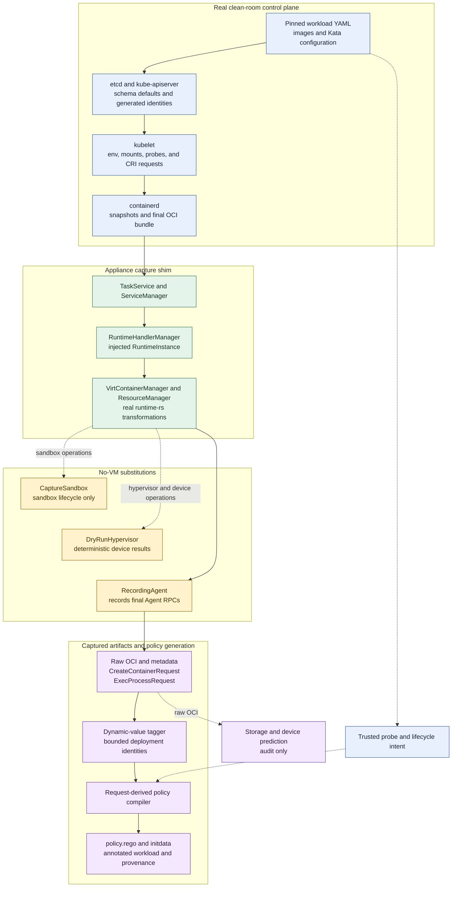

# GenPolicy OCI conversion appliance

This directory implements the versioned clean-room pipeline described in
[`DESIGN.md`](DESIGN.md).

The staged refactoring and build-optimization roadmap is maintained in
[`SIMPLIFICATION_PLAN.md`](SIMPLIFICATION_PLAN.md).

## Dry-run capture pipeline

The default backend runs the production Kubernetes and runtime-rs request
transformation path, but replaces the VM, hypervisor side effects, and guest
Agent with appliance-owned dry-run implementations:



The solid path produces policy inputs. The predictor's dashed path is retained
for diagnostics and comparison only; it is never a fallback for a missing
final `CreateContainerRequest`. `CaptureSandbox` and `DryRunHypervisor` satisfy
runtime-rs interfaces without starting a VMM, while `RecordingAgent` is the
authoritative interception point for final create and live exec requests.

## Prerequisites

### Host

- Linux host with a container engine (`docker` or `podman`; `CONTAINER_ENGINE`
  selects it for `make image`).
- The appliance is a **container**. It runs `--privileged`, boots a throwaway
  Kubernetes control plane, and seals its own outbound network. It's
  recommended to run it inside a **disposable VM** instead of a bare-metal
  host. The VM (or host, if you skip the VM) must expose a unified cgroup v2
  hierarchy (`stat -fc %T /sys/fs/cgroup` reports `cgroup2fs`) for
  `--cgroupns=host`.
- The base pipeline boots a throwaway Kubernetes control plane and routes the
  `kata` RuntimeClass through an appliance-owned runtime-rs capture shim. The
  shim uses a dry-run hypervisor and recording Agent, so no guest VM is booted
  and no hardware virtualization is required.

### EROFS dm-verity rootfs capture

Select `PROFILE=k8s-1.33-containerd-2.3-erofs-dmverity` to run the main capture
containerd with its built-in EROFS differ, snapshotter, and mount manager in
strict `dmverity_mode = "on"`. The runtime-rs capture shim receives those real
rootfs mounts and `RecordingAgent` records the resulting
`X-kata.dmverity.*` storage options. No per-image containerd, copied layer blob,
synthetic mount array, or storage-predictor result contributes to policy input.
The userspace tooling is bundled in the profile image; only the kernel features
below must be provided by the host whose kernel the container shares:

The policy compiler requires one captured `CreateContainerRequest` for every
container. Its final shim-derived OCI, storages, devices, rewritten mounts, and
rootfs integrity pins are authoritative; there is no OCI-config or storage-
predictor fallback. This path currently targets the Kata-CC `shared_fs="none"`
profile; virtio-fs prediction remains diagnostic only.

| Component | Requirement | Verify |
|-----------|-------------|--------|
| Linux kernel | `erofs` filesystem (`CONFIG_EROFS_FS`, ≥ 5.4) | `modprobe erofs && grep -w erofs /proc/filesystems` |
| Device mapper | `dm-verity` target (`CONFIG_DM_VERITY`) | `modprobe dm-verity && dmsetup targets \| grep verity` |
| Loop devices | `losetup` + free `/dev/loopN` | `losetup -f` |

The bundled userspace tooling (for reference; no host install needed):

| Component | Bundled version | Purpose |
|-----------|-----------------|---------|
| erofs-utils | ≥ 1.8.2 (`mkfs.erofs`) | the differ needs the fsmerge `mkfs_options` |
| containerd | ≥ 2.2 (erofs snapshotter + differ) | authoritative dm-verity root-hash generation |
| cryptsetup | `veritysetup` | dm-verity tooling |

Verified working on kernel `6.18` (WSL2): `erofs` present in
`/proc/filesystems` and the `dm-verity` device-mapper target reports `v1.13.0`.
If the kernel lacks `erofs` or `dm-verity`, this profile cannot run. Use the
guest-pull profile instead; rootfs modes are separate exact profiles rather than
runtime feature flags.

Run static and unit validation:

```bash
make validate
```

Build the profile image:

```bash
make image
```

The default image uses the integrated runtime-rs capture shim and records live
create and exec requests. To build the upstream-compatible runc capture path,
which does not require the runtime-rs constructor additions, run:

```bash
make image CAPTURE_BACKEND=runc
```

The runc backend captures OCI bundles during the Kubernetes run and replays
them through the standalone no-VM `createreq-capture` tool. It captures final
create requests but does not observe live probe `ExecProcessRequest` calls.

Run it inside a disposable Linux VM:

```bash
mkdir -p input/images output
cp tests/fixtures/pod.yaml input/workload.yaml

docker run --rm --privileged --network=none \
  --cgroupns=host \
  -e GENPOLICY_KATA_CONFIG=/input/configuration.toml \
  -v "$PWD/input:/input:ro" \
  -v "$PWD/output:/output" \
  genpolicy-appliance:k8s-1.33.13-containerd-2.3.3
```

Every `containers`, `initContainers`, and `ephemeralContainers` image in the
input YAML must use an immutable repository
`@sha256:<manifest-digest>` reference. Mutable tags, including version-looking
tags and `latest`, fail before the clean-room cluster starts. A matching image
archive in `input/images` is used when available; otherwise the appliance pulls
the digest-qualified reference from its repository. It then blocks outbound
traffic before starting Kubernetes. Use `--network=none` only when every
requested digest is already available from an input archive or a fixture built
into the appliance. Omit it when repository downloads are required; the
appliance seals its own outbound traffic after those downloads finish.
The image includes local pause and BusyBox fixtures used by `make e2e`.

After capture and compilation, `make e2e` starts a local policy-enabled Agent
with `KATA_AGENT_POLICY_ONLY=true`. It installs the generated policy and uses
`kata-agent-ctl` to replay every captured `CreateContainerRequest` and
`ExecProcessRequest` in order. The Agent executes its normal deserialization,
policy evaluation, and policy-state updates, then returns success before guest
mount, device, or process setup. Any policy denial fails the test, and the
evaluated inputs are retained as `policy-runtime-inputs.jsonl` for diagnostics.
This mode is disabled by default and is intended only for policy compatibility
testing outside a guest VM.

Successful runs produce the request-derived `policy.rego`,
`policy-annotation.txt`, `workload-policy.yaml`, and `policy-oci-diff.json`.
The production appliance contains the standalone Rust policy compiler and does
not contain or invoke the legacy GenPolicy executable.

Each successful run also writes an independently verifiable capture bundle to
`output/capture/`. Its `manifest.json` records the normalized profile, exact
component versions, capture backend and rootfs mode, configuration and capture
binary hashes, external image-archive hashes, request counts, and the hash and
size of every bundled artifact. The bundle contains immutable copies of the
workload, API objects, raw OCI inputs, final create and exec requests, profile,
configuration, resolved image manifests and configs, and capture-time logs.
Image metadata is read from containerd's content store and stored by verified
SHA-256 digest under `output/capture/images/`, allowing later analysis to
distinguish image-config defaults from YAML and runtime mutations. Existing
root-level outputs remain in place while capture and analysis orchestration are
separated.

Capture-only execution is the default. The appliance exits after validating
`output/capture/` and does not generate policy artifacts. Set
`GENPOLICY_CAPTURE_ONLY=0` only for temporary compatibility with the former
combined capture-and-analysis workflow; new automation should run
`analyze_capture.sh` separately.

Validate a stored bundle without rerunning Kubernetes:

```bash
python3 scripts/capture_bundle.py validate \
  --bundle output/capture \
  --require-complete
```

Regenerate balanced policy from the stored bundle without rerunning Kubernetes:

```bash
scripts/analyze_capture.sh output/capture analysis
```

The driver validates the bundle first and writes `policy.rego`, dynamic tags,
policy diff, annotation, and annotated workload under `analysis/`. Add
`--agent-replay` and set `KATA_AGENT` and `AGENT_CTL` to run the optional
policy-only Agent validation. `make e2e` performs a separate network-disabled
analysis pass and requires its policy to match the combined run's balanced
policy byte for byte.

Select an exact capture profile with `PROFILE`. The authoritative runtime-rs
profiles cover strict EROFS dm-verity and image guest-pull. A separate runc
profile preserves the native-snapshotter fallback and pre-Kata OCI baseline:

```bash
make PROFILE=k8s-1.33-containerd-2.3-guest-pull image
make PROFILE=k8s-1.33-containerd-2.3-erofs-dmverity image
make PROFILE=k8s-1.33-containerd-2.3-runc-native image
```

Only the guest-pull profile enables runtime-rs's `force_guest_pull` experiment.
Capture validation requires `image_guest_pull` storage in every guest-pull
`CreateContainerRequest`.

The `runc-native` profile is deliberately not a Kata Agent request profile. It
runs the real Kubernetes, CRI, containerd native snapshotter, and runc path, so
its raw OCI bundles are authoritative through the runc boundary and provide the
fallback and pre-Kata comparison baseline. The profile's
`REQUEST_AUTHORITY=raw-oci` records that boundary in `profile.json`, and the
bundle promotes it to `manifest.json` as `capture.request_authority`. Any
`CreateContainerRequest` files produced afterward by `createreq-capture` are
reconstructions for diagnostics and compiler compatibility; they were not
emitted by runtime-rs or observed by `RecordingAgent` and must not be compared
as equivalent evidence to the guest-pull or EROFS profiles.

There is no runtime-rs native profile in the no-VM appliance. An ordinary
native-snapshotter bind rootfs requires a Kata shared-filesystem transport such
as virtio-fs. With no VM and `shared_fs = "none"`, runtime-rs correctly rejects
that mount. Such a profile can be added only with a real or faithfully modeled
shared-filesystem boundary.

## Environment sources

The appliance does not reconstruct Kubernetes environment variables from
workload YAML. It submits ConfigMaps, Secrets, and workloads to the clean-room
API server, lets the real kubelet resolve `envFrom` and `env[].valueFrom`, and
captures the resulting OCI `process.env` at the runtime boundary. Kubernetes
therefore decides optional-reference behavior, source ordering, explicit `env`
overrides, prefixes, key validation, downward API fields, and resource-field
quantities.

Captured values are exact policy inputs unless the appliance can establish a
bounded deployment-time identity. For example:

| Environment source | Policy treatment |
|---|---|
| ConfigMap or Secret through `envFrom` | Each kubelet-expanded `KEY=value` is exact. `envFrom.prefix` is already reflected in the captured key. |
| `configMapKeyRef` or `secretKeyRef` | The selected kubelet-expanded value is exact. |
| `fieldRef` for generated Pod name, Pod UID, or node name | Replaced with `$(sandbox-name)`, `$(pod-uid)`, or `$(node-name)` after matching an API-server/profile value. Other resolved fields remain exact. |
| `resourceFieldRef` | The quantity calculated by kubelet is captured exactly. |
| Kubernetes service environment variable | Legacy-compatible mode uses the inherited bounded service-variable regexes. Balanced mode retains the captured endpoint exactly. |

The original GenPolicy handles the same YAML forms by reconstructing values
offline rather than observing kubelet. Its important fidelity limits are:

| Legacy input | Legacy GenPolicy behavior |
|---|---|
| `envFrom.configMapRef` / `envFrom.secretRef` | Expands resources supplied in the input or with `--config-file`, but ignores `prefix`, `optional`, namespaces, and kubelet duplicate-key precedence. Missing references fail generation. |
| `configMapKeyRef` / `secretKeyRef` | Resolves supplied resources by name, but ignores `optional` and namespaces. Secret data must be valid base64 and UTF-8. |
| `fieldRef` | Maps a fixed set of fields to policy macros or exact YAML values. Unsupported fields fail generation; missing annotations may become the broad `$(todo-annotation)` placeholder. |
| `resourceFieldRef` | Does not calculate the requested resource, divisor, or container value. Every selector becomes the broad `$(resource-field)` placeholder. |

Secret values are base64-decoded by Kubernetes before runtime capture. They
therefore appear in plaintext in `createcontainer-requests/`, tagged requests,
policy data, and related reports. Treat the complete output directory as
sensitive and regenerate policy whenever an exact ConfigMap or Secret value
changes.

## Balanced policy mode

The legacy-compatible policy remains the default. To generate the supported
balanced policy alongside it, set `GENPOLICY_BALANCED=1`:

```bash
docker run --rm --privileged --network=none \
  -e GENPOLICY_BALANCED=1 \
  --cgroupns=host \
  -v "$PWD/input:/input:ro" \
  -v "$PWD/output:/output" \
  genpolicy-appliance:k8s-1.33.13-containerd-2.3.3
```

The run additionally emits:

- `policy-balanced.rego`: pins service endpoints and the special
  termination-message path to the externally backed
  `/dev/termination-log` mount and clears inherited environment regexes.
  It emulates Kata's `nerdctl/network-namespace` injection from the sandbox OCI
  network namespace and generalizes the generated CNI path with a bounded
  regex. It also retains generated name/UID markers wherever those values
  occur, so this mode still has documented correlation risks;
- `policy-mode-report.json`: compares balanced behavior against the
  default legacy-compatible policy. The
  legacy-reference image also compares the original GenPolicy output with the
  request-derived legacy-compatible policy, including environment, mount, working
  directory, and exec-probe differences.

Balanced mode reduces regex authorization while preserving deployment-time
generated identities. It requires policy regeneration when an exact service
ClusterIP or port changes. Raw requests under `createcontainer-requests/` are
the reference for fields that cannot be made portable safely; the appliance
does not emit a knowingly undeployable exact policy.

The report also records unresolved enforcement needs: request capture does not yet
retain per-environment-variable provenance or required/duplicate-key
semantics, and a more portable external-endpoint mode needs structured
exclusion of UVM-local/control addresses rather than a generic IP regex.

Balanced generation rejects custom termination-message paths unless
they can be proven equivalent to the dedicated external kubelet bind mount.
This prevents a termination write from being redirected into image code or
other UVM-internal trusted state. The proof matches the kubelet path role and
suffix, not an appliance-specific host installation directory.

`make e2e` additionally builds a test-only `legacy-reference` image. That image
runs both compilers against the same capture so the standalone result can be
checked against legacy behavior without adding the legacy executable to the
production appliance.

## Legacy request defaults and stream I/O

The appliance retains the legacy GenPolicy request baseline. Both generators
load the same `genpolicy-settings.json`, and the appliance serializes the
resulting `request_defaults` into `policy_data`. It also prepends the same
shared `rules.rego` to the generated policy. The appliance settings drop-in
changes only the pause image; it does not replace request defaults. Therefore,
the appliance is not missing a separate set of legacy hardcoded endpoint
rules.

The shared Rego hardcodes a small lifecycle and observation baseline as
allowed: `DestroySandboxRequest`, `GetOOMEventRequest`,
`GuestDetailsRequest`, `OnlineCPUMemRequest`, `RemoveContainerRequest`,
`RemoveStaleVirtiofsShareMountsRequest`, `SignalProcessRequest`,
`StartContainerRequest`, `StatsContainerRequest`, `TtyWinResizeRequest`, and
`WaitProcessRequest`. Other Agent endpoints default to denied unless a
specific rule admits them. The settings-backed rules for container creation,
copy-file paths, exec commands, routes, interfaces, ARP neighbors, diagnostic
data, ephemeral mounts, and legacy streams are inherited unchanged.

Legacy settings deny all three older stream RPC controls by default:

| Operation | Legacy and appliance default |
|---|---|
| `WriteStreamRequest` to process stdin | Denied. |
| `CloseStdinRequest` | Denied. |
| `ReadStreamRequest` from stdout or stderr | Denied. |

These are global RPC switches, not per-container or per-stream permissions.
Enabling `ReadStreamRequest`, for example, does not distinguish stdout from
stderr or one process from another. Legacy GenPolicy maps Kubernetes `tty` to
the OCI process `Terminal` field, but its parsed Kubernetes `stdin` value does
not generate stream authorization.

Passfd I/O is a separate transport path. Legacy policy does not represent
`stdin_port`, `stdout_port`, or `stderr_port`, so denying the old stream RPCs
does not constrain a non-zero passfd handle. The appliance currently closes
that gap by rejecting configured create-time passfd ports during generation
and requiring all three exec-time ports to be zero in Rego. This is a
fail-closed compatibility gate, not the intended long-term per-process stream
model. stdout and stderr remain host-visible, suppressible output and must not
be treated as trusted security evidence even after policy-bound passfd support
is added.

## Device, runtime-exec, and CopyFile policy status

| Surface | Appliance status | Enforcement boundary |
|---|---|---|
| Non-VFIO `CreateContainerRequest.devices` | Supported for final-request shape admission. | The compiler retains captured records. Rego requires exact cardinality and unique paths; non-empty captured `id`, type, `vm_path`, and options are exact. Empty legacy placeholder fields remain path-only. This does not bind a resolved physical device identity. |
| Kubernetes `volumeDevices` | Supported as a bounded container-visible device path, subject to authoritative final request capture. | Workload YAML supplies the declared path as an additional OCI policy check. It does not prove the backing block device's identity, integrity, confidentiality, or contents. |
| NVIDIA pGPU through VFIO/CDI | Supported at the request-shape level, not as physical-device identity enforcement. | The compiler preserves one unsuffixed VFIO requirement per declared pGPU instead of pinning captured runtime numbers. Rego checks count, type, guest path shape, PCI option grammar, unique runtime device numbers, and CDI suffix correlation. A no-GPU clean room cannot identify the production device; trusted hotplug registry binding and post-CDI effective-plan authorization require future Agent changes. |
| Probe and lifecycle exec actions | Supported with exact argv arrays read from trusted workload YAML. | These future requests are absent from `CreateContainerRequest`. Rego also checks the target container's recorded state and process user, environment, cwd, no-new-privileges, empty exec capabilities, and terminal semantics. Authorization is command-based, not caller/probe provenance-based: the same exact request can be issued through another exec client. |
| Arbitrary `kubectl exec` | Denied by default. | The appliance defaults contain no global allowed commands or exec regexes. A command identical to an allowed probe or lifecycle action is nevertheless admitted. Until one-shot stream binding is implemented in the Agent, exec-process passfd ports are required to be zero. |
| Runtime-rs `CopyFileRequest` for ConfigMap, Secret, projected, and runtime files | Supported within the configured Kata shared-directory domain. | Capture executes but does not record individual copy requests. Shared Rego constrains path, regular/directory/symlink type, traversal, relative symlink targets, and non-negative in-range offsets using the static `$(sfprefix)` rule. It does not authorize exact file sets, metadata, sizes, chunk sequences, or content. Agent `pathrs` handling confines writes beneath the guest shared directory. Host-provided contents remain mutable and untrusted. |
| `kubectl cp` | Not a `CopyFileRequest` feature and denied by default. | `kubectl cp` normally invokes `tar` through `ExecProcessRequest`; it works only if the resulting exact exec command is separately authorized. |

## Volume and shared-mount handling

The appliance requires a captured `CreateContainerRequest` as the authority for
every container. Missing or incomplete request capture fails generation. The
storage predictor remains an audit artifact and workload YAML supplies only
policy data for operations absent from container creation, such as exec probes.

| Volume form | Legacy GenPolicy | Appliance handling | Policy result |
|---|---|---|---|
| ConfigMap/Secret with `shared_fs = "none"` | Predicts a settings-based `$(sfprefix)` bind mount and, by default, no Agent `Storage`; it does not execute the shim's `CopyFile` path. | Runs the real runtime-rs copy-to-guest path. The recording Agent accepts `CopyFile` calls, and the captured final request contains no `Storage` but has a rewritten bind source matching `<cpath>/<cid>-<16 hex>-<destination basename>`. | Supported. Pins the rewritten mount shape and confines `CopyFile` paths and file types; it does not attest the host-supplied file contents. |
| Raw-block PVC through `volumeDevices` | Emits an `agent::Device` and OCI Linux device from the declared `devicePath`; pins only the container path. | Uses the final captured request devices. | Supported. Bounds the device path, not the device identity, integrity, confidentiality, or mutable contents. |
| Filesystem PVC through shared fs | Emits a generic shared bind mount and no block `Storage`. | The clean-room cluster has no CSI driver, so it cannot materialize an ordinary PVC from YAML. | Fail-closed unless a separately supported authoritative fixture can reproduce the final shim request. |
| Plain block-backed `emptyDir` | Emits the configured plain block-storage template. | Runs the real runtime-rs block-`emptyDir` handler with the dry-run device manager and captures its final `blk`, `scsi`, or platform-equivalent storage and rewritten mount. | Supported. Pins filesystem, options, `fsGroup`, sharing, and the mount-point/device-ID relationship. |
| CDH-managed encrypted block `emptyDir` | Emits the configured encrypted block-storage template. | Runs the real runtime-rs `block-encrypted` handler and captures the final request containing `encryption_key=ephemeral`, `create_filesystem`, the block storage, and rewritten mount. The recording Agent stops at the request boundary; it does not run CDH or create a LUKS mapping. | High-fidelity request capture. Policy pins the CDH trigger and the complete storage/mount relationship. Production CDH/LUKS execution is covered by Kata's confidential Kubernetes integration test, not by this no-VM appliance. |
| CSI direct filesystem-mounted block volume | Has no direct-volume or `mountInfo.json` model; the extra runtime storage and rewritten mount are denied. | `GENPOLICY_DIRECT_VOLUME_MOUNTS` replays operator-supplied `mountInfo.json` data so `createreq-capture` records the real shim storage and mount. The compiler does not yet admit this storage class. | Captured but fail-closed. A dedicated direct-volume path template and Rego clause are required. |
| CDH/KBS-backed persistent encrypted volume | Not represented for persistent PVCs. | Raw CSI direct volumes do not add a CDH key identity or encryption operation to the Agent request. | Unsupported in the production runtime/Agent contract; adding real CSI components to the appliance would not close this gap. |
| Cross-container `shared_mounts` annotation | Not represented in `ContainerPolicy`; the shared Rego requires `count(input.shared_mounts) == 0`, so a non-empty request is denied at runtime. | Captures the final destination-container mappings but rejects any non-empty list during policy generation. | Unsupported and fail-closed in both. Potential future support requires exact policy declarations plus Agent-side mount-identity registration, fd-relative path confinement, and checked one-time cloning; path-string allowlisting alone is insufficient. |

### Encrypted `emptyDir` fidelity boundary

For `emptydir_mode = "block-encrypted"`, the appliance has high fidelity at the
policy-relevant shim/Agent boundary. The capture shim runs the production
runtime-rs block-`emptyDir` handler, including sparse backing-file creation,
block-device synthesis, storage construction, mount rewriting, and propagation
of `fsGroup`. The captured `CreateContainerRequest` therefore contains the same
`encryption_key=ephemeral` and `create_filesystem` driver options that make the
production Agent call CDH `secure_mount`.

The appliance deliberately does not claim execution fidelity beyond that
boundary. Its recording Agent serializes the request instead of booting a guest,
calling CDH, creating a LUKS2/dm-crypt mapping, formatting ext4, and mounting the
result. That production path is exercised by
`tests/integration/kubernetes/k8s-trusted-ephemeral-data-storage.bats`, which
checks the active dm-crypt cipher and integrity mode and verifies filesystem I/O.
The appliance tests instead verify that the captured CDH trigger and correlated
storage, device, mount, ownership, and sharing fields are admitted exactly and
that altered requests are denied.

### Configure encrypted `emptyDir` capture

Encrypted `emptyDir` capture is selected by the deployment Kata
`configuration.toml`, not by the workload YAML. Mount the configuration into the
appliance and set `GENPOLICY_KATA_CONFIG` to its in-container path. The appliance
loads the file without validating deployment-only hypervisor binary paths, then
uses its active hypervisor, block driver, shared-filesystem mode, and
`emptydir_mode` for both prediction and authoritative request capture.

Use the production node's Kata configuration when generating deployable policy.
For an isolated appliance test, this minimal profile selects the relevant path:

```toml title="input/configuration.toml"
[hypervisor.qemu]
shared_fs = "none"
block_device_driver = "virtio-blk-pci"

[runtime]
hypervisor_name = "qemu"
emptydir_mode = "block-encrypted"
```

The workload must contain a disk-backed `emptyDir` (an omitted or empty
`medium`, not `medium: Memory`) and mount it into a container. Run the appliance
with the configuration already under the read-only `/input` mount:

```bash
docker run --rm --privileged --network=none \
  --cgroupns=host \
  -e GENPOLICY_KATA_CONFIG=/input/configuration.toml \
  -v "$PWD/input:/input:ro" \
  -v "$PWD/output:/output" \
  genpolicy-appliance:k8s-1.33.13-containerd-2.3.3
```

The file is required for every policy generation run because request capture
cannot reproduce the deployment shim without it. Its `emptydir_mode`, block
driver, and shared-filesystem mode are authoritative. The corresponding
environment variables affect the audit-only predictor and are not compiler
fallbacks.

## Inspect storage and device transformation

`tests/fixtures/storage-boundary-workload.yaml` contains `emptyDir`,
ConfigMap, host-directory, and host-character-device mounts. Run it with an
output directory preserved on the host:

```bash
cp tests/fixtures/storage-boundary-workload.yaml input/workload.yaml

docker run --rm --privileged --network=none \
  --cgroupns=host \
  -v "$PWD/input:/input:ro" \
  -v "$PWD/output:/output" \
  genpolicy-appliance:k8s-1.33.13-containerd-2.3.3
```

Kubelet and containerd materialize the YAML volumes as bind mounts in
`output/raw/*.config.json`. Policy generation then fails on the first
unsupported workload bind mount. This is intentional: the raw OCI demonstrates
the transformation, but the appliance does not authorize the source until it
can prove whether the resolved backing object is external to the UVM.
