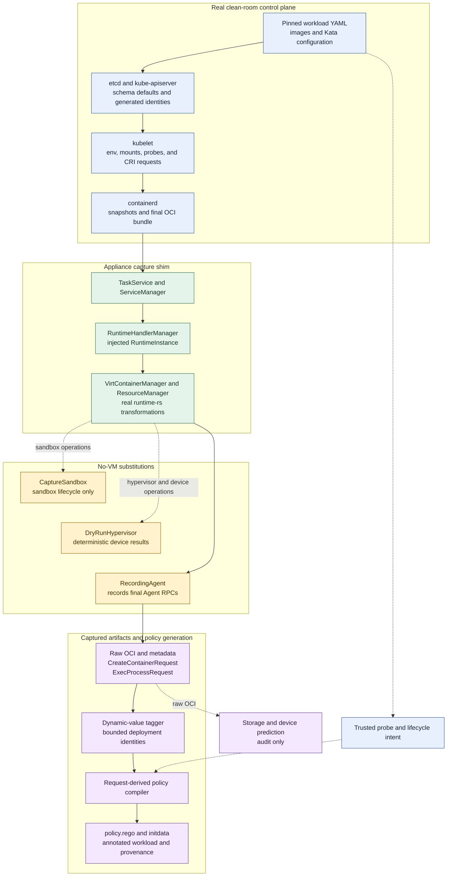

# GenPolicy OCI conversion appliance

This directory implements the versioned clean-room pipeline described in
[`DESIGN.md`](DESIGN.md).

The staged refactoring and build-optimization roadmap is maintained in
[`SIMPLIFICATION_PLAN.md`](SIMPLIFICATION_PLAN.md).

## Dry-run capture pipeline

The default backend runs the production Kubernetes and runtime-rs request
transformation path, but replaces the VM, hypervisor side effects, and guest
Agent with appliance-owned dry-run implementations:



The solid path produces policy inputs. The predictor's dashed path is retained
for diagnostics and comparison only; it is never a fallback for a missing
final `CreateContainerRequest`. `CaptureSandbox` and `DryRunHypervisor` satisfy
runtime-rs interfaces without starting a VMM, while `RecordingAgent` is the
authoritative interception point for final create and live exec requests.

## Prerequisites

### Host

- Linux host with a container engine (`docker` or `podman`; `CONTAINER_ENGINE`
  selects it for `make image`).
- The appliance is a **container**. It runs `--privileged`, boots a throwaway
  Kubernetes control plane, and seals its own outbound network. It's
  recommended to run it inside a **disposable VM** instead of a bare-metal
  host. The VM (or host, if you skip the VM) must expose a unified cgroup v2
  hierarchy (`stat -fc %T /sys/fs/cgroup` reports `cgroup2fs`) for
  `--cgroupns=host`.
- The base pipeline boots a throwaway Kubernetes control plane and routes the
  `kata` RuntimeClass through an appliance-owned runtime-rs capture shim. The
  shim uses a dry-run hypervisor and recording Agent, so no guest VM is booted
  and no hardware virtualization is required.

### EROFS dm-verity rootfs capture

Select `PROFILE=k8s-1.33-containerd-2.3-erofs-dmverity` to run the main capture
containerd with its built-in EROFS differ, snapshotter, and mount manager in
strict `dmverity_mode = "on"`. The runtime-rs capture shim receives those real
rootfs mounts and `RecordingAgent` records the resulting
`X-kata.dmverity.*` storage options. No per-image containerd, copied layer blob,
synthetic mount array, or storage-predictor result contributes to policy input.
The userspace tooling is bundled in the profile image; only the kernel features
below must be provided by the host whose kernel the container shares:

The policy compiler requires one captured `CreateContainerRequest` for every
container. Its final shim-derived OCI, storages, devices, rewritten mounts, and
rootfs integrity pins are authoritative; there is no OCI-config or storage-
predictor fallback. This path currently targets the Kata-CC `shared_fs="none"`
profile; virtio-fs prediction remains diagnostic only.

| Component | Requirement | Verify |
|-----------|-------------|--------|
| Linux kernel | `erofs` filesystem (`CONFIG_EROFS_FS`, ≥ 5.4) | `modprobe erofs && grep -w erofs /proc/filesystems` |
| Device mapper | `dm-verity` target (`CONFIG_DM_VERITY`) | `modprobe dm-verity && dmsetup targets \| grep verity` |
| Loop devices | `losetup` + free `/dev/loopN` | `losetup -f` |

The bundled userspace tooling (for reference; no host install needed):

| Component | Bundled version | Purpose |
|-----------|-----------------|---------|
| erofs-utils | ≥ 1.8.2 (`mkfs.erofs`) | the differ needs the fsmerge `mkfs_options` |
| containerd | ≥ 2.2 (erofs snapshotter + differ) | authoritative dm-verity root-hash generation |
| cryptsetup | `veritysetup` | dm-verity tooling |

Verified working on kernel `6.18` (WSL2): `erofs` present in
`/proc/filesystems` and the `dm-verity` device-mapper target reports `v1.13.0`.
If the kernel lacks `erofs` or `dm-verity`, this profile cannot run. Use the
guest-pull profile instead; rootfs modes are separate exact profiles rather than
runtime feature flags.

Run static and unit validation:

```bash
make validate
```

Build the profile image:

```bash
make image
```

The default image uses the integrated runtime-rs capture shim and records live
create and exec requests. To build the upstream-compatible runc capture path,
which does not require the runtime-rs constructor additions, run:

```bash
make image CAPTURE_BACKEND=runc
```

The runc backend captures OCI bundles during the Kubernetes run and replays
them through the standalone no-VM `createreq-capture` tool. It captures final
create requests but does not observe live probe `ExecProcessRequest` calls.

Run it inside a disposable Linux VM:

```bash
mkdir -p input/images output
cp tests/fixtures/pod.yaml input/workload.yaml
cp tests/fixtures/configuration.toml input/configuration.toml

docker run --rm --privileged --network=none \
  --cgroupns=host \
  -e GENPOLICY_KATA_CONFIG=/input/configuration.toml \
  -v "$PWD/input:/input:ro" \
  -v "$PWD/output:/output" \
  genpolicy-appliance:k8s-1.33.13-containerd-2.3.3
```

Every `containers`, `initContainers`, and `ephemeralContainers` image in the
input YAML must use an immutable repository
`@sha256:<manifest-digest>` reference. Mutable tags, including version-looking
tags and `latest`, fail before the clean-room cluster starts. A matching image
archive in `input/images` is used when available; otherwise the appliance pulls
the digest-qualified reference from its repository. It then blocks outbound
traffic before starting Kubernetes. Use `--network=none` only when every
requested digest is already available from an input archive or a fixture built
into the appliance. Omit it when repository downloads are required; the
appliance seals its own outbound traffic after those downloads finish.
The image includes local pause and BusyBox fixtures used by `make e2e`.

After capture and compilation, `make e2e` starts a local policy-enabled Agent
with `KATA_AGENT_POLICY_ONLY=true`. It installs the generated policy and uses
`kata-agent-ctl` to replay every captured `CreateContainerRequest` and
`ExecProcessRequest` in order. The Agent executes its normal deserialization,
policy evaluation, and policy-state updates, then returns success before guest
mount, device, or process setup. Any policy denial fails the test, and the
evaluated inputs are retained as `policy-runtime-inputs.jsonl` for diagnostics.
This replay is disabled during ordinary capture and is intended only for policy
compatibility testing outside a guest VM.

An ordinary production-image run is capture-only and produces `output/capture/`.
The production capture image contains neither policy generator. The separate
analysis image contains the request-derived compiler but not native Legacy
GenPolicy. Successful analysis writes `policy.rego`, `policy-annotation.txt`,
`workload-policy.yaml`, and `policy-oci-diff.json`.

Each successful capture run writes an independently verifiable capture bundle to
`output/capture/`. Its `manifest.json` records the normalized profile, exact
component versions, capture backend and rootfs mode, configuration and capture
binary hashes, external image-archive hashes, request counts, and the hash and
size of every bundled artifact. The bundle contains immutable copies of the
workload, API objects, raw OCI inputs, final create and exec requests, profile,
configuration, resolved image manifests and configs, and capture-time logs.
Image metadata is read from containerd's content store and stored by verified
SHA-256 digest under `output/capture/images/`, allowing later analysis to
distinguish image-config defaults from YAML and runtime mutations. Existing
root-level outputs remain in place while capture and analysis orchestration are
separated.

Capture-only execution is the default. The appliance exits after validating
`output/capture/` and does not generate policy artifacts. Production capture
images do not contain a compiler, so new automation must run the analysis image
or `analyze_capture.sh` separately. `GENPOLICY_CAPTURE_ONLY=0` is retained only
for test-only images, such as `legacy-reference`, that deliberately include a
generator.

Validate a stored bundle without rerunning Kubernetes:

```bash
python3 scripts/capture_bundle.py validate \
  --bundle output/capture \
  --require-complete
```

Generate the request-derived policy from the stored bundle without rerunning
Kubernetes:

```bash
make analysis-image

docker run --rm --network=none \
  -v "$PWD/output/capture:/capture:ro" \
  -v "$PWD/analysis:/analysis" \
  genpolicy-analysis:latest /capture /analysis
```

The driver validates the bundle first and writes `policy.rego`, dynamic tags,
policy diff, annotation, annotated workload, request provenance, and
`storage-mount-analysis.json` under `analysis/`. The storage/mount report marks
each known request-shape claim as `confirmed`, `not-exercised`, or
`not-authoritative` and links confirmations to request JSON pointers. The
report names unsupported rootfs, generic block/direct-volume storage,
non-watchable shared-filesystem mounts, and block/VFIO/other Agent device
shapes instead of folding them into an undifferentiated `other` class.
`policy-oci-diff.json` separately records the sandbox storage contract copied
from versioned settings with `capture_status = not-captured`; the real
`CreateSandboxRequest` remains VM-coupled and is not reconstructed as evidence.
Add `--agent-replay` and set `KATA_AGENT` and `AGENT_CTL` to run the optional
policy-only Agent validation. `make e2e` performs a separate network-disabled
analysis pass and requires its `policy.rego` to match the test-only reference run's
request-derived policy byte for byte.

Select an exact capture profile with `PROFILE`. The authoritative runtime-rs
profiles cover strict EROFS dm-verity and image guest-pull. A separate runc
profile preserves the native-snapshotter fallback and pre-Kata OCI baseline:

```bash
make PROFILE=k8s-1.33-containerd-2.3-guest-pull image
make PROFILE=k8s-1.33-containerd-2.3-erofs-dmverity image
make PROFILE=k8s-1.33-containerd-2.3-runc-native image
```

Only the guest-pull profile enables runtime-rs's `force_guest_pull` experiment.
Capture validation requires `image_guest_pull` storage in every guest-pull
`CreateContainerRequest`.

The `runc-native` profile is deliberately not a Kata Agent request profile. It
runs the real Kubernetes, CRI, containerd native snapshotter, and runc path, so
its raw OCI bundles are authoritative through the runc boundary and provide the
fallback and pre-Kata comparison baseline. The profile's
`REQUEST_AUTHORITY=raw-oci` records that boundary in `profile.json`, and the
bundle promotes it to `manifest.json` as `capture.request_authority`. Any
`CreateContainerRequest` files produced afterward by `createreq-capture` are
reconstructions for diagnostics and compiler compatibility; they were not
emitted by runtime-rs or observed by `RecordingAgent` and must not be compared
as equivalent evidence to the guest-pull or EROFS profiles.

There is no runtime-rs native profile in the no-VM appliance. An ordinary
native-snapshotter bind rootfs requires a Kata shared-filesystem transport such
as virtio-fs. With no VM and `shared_fs = "none"`, runtime-rs correctly rejects
that mount. Such a profile can be added only with a real or faithfully modeled
shared-filesystem boundary.

## Environment sources

The appliance does not reconstruct Kubernetes environment variables from
workload YAML. It submits ConfigMaps, Secrets, and workloads to the clean-room
API server, lets the real kubelet resolve `envFrom` and `env[].valueFrom`, and
captures the resulting OCI `process.env` at the runtime boundary. Kubernetes
therefore decides optional-reference behavior, source ordering, explicit `env`
overrides, prefixes, key validation, downward API fields, and resource-field
quantities.

Captured values are exact policy inputs unless the appliance can establish a
bounded deployment-time identity. For example:

| Environment source | Policy treatment |
|---|---|
| ConfigMap or Secret through `envFrom` | Each kubelet-expanded `KEY=value` is exact. `envFrom.prefix` is already reflected in the captured key. |
| `configMapKeyRef` or `secretKeyRef` | The selected kubelet-expanded value is exact. |
| `fieldRef` for generated Pod name, Pod UID, or node name | Replaced with `$(sandbox-name)`, `$(pod-uid)`, or `$(node-name)` after matching an API-server/profile value. Other resolved fields remain exact. |
| `resourceFieldRef` | The quantity calculated by kubelet is captured exactly. |
| Kubernetes service environment variable | The compiler emits one anchored, typed regex for each captured variable name, allowing production ClusterIP and port reassignment without authorizing undeclared service variables. |

The original GenPolicy handles the same YAML forms by reconstructing values
offline rather than observing kubelet. Its important fidelity limits are:

| Legacy input | Legacy GenPolicy behavior |
|---|---|
| `envFrom.configMapRef` / `envFrom.secretRef` | Expands resources supplied in the input or with `--config-file`, but ignores `prefix`, `optional`, namespaces, and kubelet duplicate-key precedence. Missing references fail generation. |
| `configMapKeyRef` / `secretKeyRef` | Resolves supplied resources by name, but ignores `optional` and namespaces. Secret data must be valid base64 and UTF-8. |
| `fieldRef` | Maps a fixed set of fields to policy macros or exact YAML values. Unsupported fields fail generation; missing annotations may become the broad `$(todo-annotation)` placeholder. |
| `resourceFieldRef` | Does not calculate the requested resource, divisor, or container value. Every selector becomes the broad `$(resource-field)` placeholder. |

Secret values are base64-decoded by Kubernetes before runtime capture. They
therefore appear in plaintext in `createcontainer-requests/`, tagged requests,
policy data, and related reports. Treat the complete output directory as
sensitive and regenerate policy whenever an exact ConfigMap or Secret value
changes.

## Compile or test a policy

The request-derived compiler emits one deployable policy flavor. It clears
inherited environment regexes, adds one anchored typed regex per captured
service-variable name, and restricts termination messages to the proven
external `/dev/termination-log` mount. Compile that policy from a stored
capture bundle with the analysis image shown above, or directly when
`genpolicy-oci-compiler` is available in `PATH`:

```bash
scripts/analyze_capture.sh output/capture analysis
```

The command writes `policy.rego`, `policy-annotation.txt`,
`workload-policy.yaml`, `policy-oci-diff.json`, and the analysis reports. It
does not generate a Legacy-compatible request-derived variant. Use native
Legacy GenPolicy when that policy flavor is required.

To test an existing Agent policy instead of compiling one, provide it with
`--policy` and the policy-enabled Agent tools. Build those host tools first:

```bash
make policy-tools
repo_root=$(git rev-parse --show-toplevel)
rust_host=$(rustc -vV | awk '/^host:/ { print $2 }')

KATA_AGENT="$repo_root/target/$rust_host/release/kata-agent" \
AGENT_CTL="$repo_root/target/debug/kata-agent-ctl" \
  scripts/analyze_capture.sh --policy input/policy.rego \
  output/capture policy-test
```

This action validates the capture bundle and replays its captured create and
exec requests against the supplied policy. It does not invoke Legacy
GenPolicy, the request-derived compiler, the tagger, or policy comparison. The
policy may have been produced by either generator or another source. Success
writes `policy-test-result.json` with `result: pass`; a policy denial writes
`result: fail`, records the failed phase and request, and returns a nonzero exit
status. `policy-runtime-inputs.jsonl` is retained for diagnostics. No policy or
annotated workload is generated in test mode.

ClusterIP and assigned-port changes within the typed grammars do not require
compiler-policy regeneration. A service topology change, such as a service
being added, removed, or renamed or its protocol changing, does require
regeneration because the compiler pins the captured variable-name set. Raw
requests under `createcontainer-requests/` are the reference for fields that
cannot be made portable safely.

The compiler report also records unresolved enforcement needs: request capture
does not yet retain per-environment-variable provenance or required/duplicate-key
semantics, and a more portable external-endpoint mode needs structured
exclusion of UVM-local/control addresses rather than a generic IP regex.

Request-derived generation rejects custom termination-message paths unless
they can be proven equivalent to the dedicated external kubelet bind mount.
This prevents a termination write from being redirected into image code or
other UVM-internal trusted state. The proof matches the kubelet path role and
suffix, not an appliance-specific host installation directory.

`make e2e` additionally builds a test-only `legacy-reference` image. That image
runs the request-derived compiler and native Legacy GenPolicy against the same
workload and capture. It retains both outputs for inspection without adding the
legacy executable to the production appliance. It does not make Legacy output
a request-derived compiler mode.

### Local policy matrix

Run a small local CI matrix that generates both policies and independently
replays each one against the authoritative requests captured for every input
YAML:

```bash
make policy-matrix
```

The default matrix covers `tests/fixtures/pod.yaml` and
`tests/fixtures/policy-matrix-env-pod.yaml`. A case passes only when capture and
both generators succeed and both policies authorize every captured create and
exec request. The command exits nonzero if any case or policy fails. There is no
expected-failure allowlist: a denial remains a visible compatibility failure.

The current baseline passes both default cases with request-derived and native
Legacy GenPolicy. The fixtures explicitly declare the synthetic image's
supplementary group so Legacy guest-pull generation remains fail-closed rather
than relying on host-side image-layer group discovery at deployment time.

Run the same matrix with the containerd 1.7 compatibility profile and keep its
artifacts separate from the default containerd 2.3 run:

```bash
make PROFILE=k8s-1.33-containerd-1.7-guest-pull \
  POLICY_MATRIX_OUTPUT="$PWD/../../../../target/genpolicy-policy-matrix-containerd-1.7" \
  policy-matrix
```

This profile uses containerd `v1.7.29`, its version-2 configuration schema, and
the Legacy OCI `1.1.0` baseline. Both policies pass both default cases. The
capture shim applies the same sandbox network normalization as production
runtime-rs, so the final request and Legacy policy both contain the bounded
`nerdctl/network-namespace` annotation. The appliance imports synthetic
workloads under their requested digest-qualified references. Guest-pull
authorization compares only the manifest digest, so changing the repository
location does not change image identity.

Supply a whitespace-separated YAML set with `POLICY_MATRIX_YAMLS`:

```bash
make policy-matrix \
  POLICY_MATRIX_YAMLS="tests/fixtures/pod.yaml /absolute/path/workload.yaml"
```

Every workload must satisfy the appliance's normal immutable-image and
readiness requirements and must be supported by both generators. Override the
Kata configuration for the complete matrix with:

```bash
make policy-matrix \
  POLICY_MATRIX_CONFIGURATION=/absolute/path/configuration.toml
```

Results are written to `target/genpolicy-policy-matrix/` by default. The
top-level `policy-matrix-results.json` contains the aggregate result and embeds
each case result. Per-case directories retain generation and replay logs,
generated policies, the capture bundle, `policy-test-result.json` for each
generator, and `policy-runtime-inputs.jsonl`. Set `POLICY_MATRIX_OUTPUT` to use
a different generated-artifact directory; the runner replaces that directory
at the start of each run.

## Legacy request defaults and stream I/O

The appliance retains the legacy GenPolicy request baseline. Both generators
load the same `genpolicy-settings.json`, and the appliance serializes the
resulting `request_defaults` into `policy_data`. It also prepends the same
shared `rules.rego` to the generated policy. The appliance settings drop-in
changes only the pause image; it does not replace request defaults. Therefore,
the appliance is not missing a separate set of legacy hardcoded endpoint
rules.

The shared Rego hardcodes a small lifecycle and observation baseline as
allowed: `DestroySandboxRequest`, `GetOOMEventRequest`,
`GuestDetailsRequest`, `OnlineCPUMemRequest`, `RemoveContainerRequest`,
`RemoveStaleVirtiofsShareMountsRequest`, `SignalProcessRequest`,
`StartContainerRequest`, `StatsContainerRequest`, `TtyWinResizeRequest`, and
`WaitProcessRequest`. Other Agent endpoints default to denied unless a
specific rule admits them. The settings-backed rules for container creation,
copy-file paths, exec commands, routes, interfaces, ARP neighbors, diagnostic
data, ephemeral mounts, and legacy streams are inherited unchanged.

Legacy settings deny all three older stream RPC controls by default:

| Operation | Legacy and appliance default |
|---|---|
| `WriteStreamRequest` to process stdin | Denied. |
| `CloseStdinRequest` | Denied. |
| `ReadStreamRequest` from stdout or stderr | Denied. |

These are global RPC switches, not per-container or per-stream permissions.
Enabling `ReadStreamRequest`, for example, does not distinguish stdout from
stderr or one process from another. Legacy GenPolicy maps Kubernetes `tty` to
the OCI process `Terminal` field, but its parsed Kubernetes `stdin` value does
not generate stream authorization.

Passfd I/O is a separate transport path. Legacy policy does not represent
`stdin_port`, `stdout_port`, or `stderr_port`, so denying the old stream RPCs
does not constrain a non-zero passfd handle. The appliance currently closes
that gap by rejecting configured create-time passfd ports during generation
and requiring all three exec-time ports to be zero in Rego. This is a
fail-closed compatibility gate, not the intended long-term per-process stream
model. stdout and stderr remain host-visible, suppressible output and must not
be treated as trusted security evidence even after policy-bound passfd support
is added.

## Device, runtime-exec, and CopyFile policy status

| Surface | Appliance status | Enforcement boundary |
|---|---|---|
| Non-VFIO `CreateContainerRequest.devices` | Supported for final-request shape admission. | The compiler retains captured records. Rego requires exact cardinality and unique paths; non-empty captured `id`, type, `vm_path`, and options are exact. Empty legacy placeholder fields remain path-only. This does not bind a resolved physical device identity. |
| Kubernetes `volumeDevices` | Supported as a bounded container-visible device path, subject to authoritative final request capture. | Workload YAML supplies the declared path as an additional OCI policy check. It does not prove the backing block device's identity, integrity, confidentiality, or contents. |
| NVIDIA pGPU through VFIO/CDI | Rule-tested at the request-shape level, not capture-confirmed or physical-device identity enforcement. | The compiler preserves one unsuffixed VFIO requirement per declared pGPU instead of pinning captured runtime numbers. Rego checks count, type, guest path shape, PCI option grammar, unique runtime device numbers, and CDI suffix correlation. Current profiles have no GPU device plugin, extended-resource capacity, CDI installation, or VFIO hardware; trusted hotplug registry binding and post-CDI effective-plan authorization require future Agent changes. |
| Probe and lifecycle exec actions | Supported with exact argv arrays read from trusted workload YAML. | These future requests are absent from `CreateContainerRequest`. Rego also checks the target container's recorded state and process user, environment, cwd, no-new-privileges, empty exec capabilities, and terminal semantics. Authorization is command-based, not caller/probe provenance-based: the same exact request can be issued through another exec client. |
| Arbitrary `kubectl exec` | Denied by default. | The appliance defaults contain no global allowed commands or exec regexes. A command identical to an allowed probe or lifecycle action is nevertheless admitted. Until one-shot stream binding is implemented in the Agent, exec-process passfd ports are required to be zero. |
| Runtime-rs `CopyFileRequest` for ConfigMap, Secret, projected, and runtime files | Supported within the configured Kata shared-directory domain. | Capture executes but does not record individual copy requests. Shared Rego constrains path, regular/directory/symlink type, traversal, relative symlink targets, and non-negative in-range offsets using the static `$(sfprefix)` rule. It does not authorize exact file sets, metadata, sizes, chunk sequences, or content. Agent `pathrs` handling confines writes beneath the guest shared directory. Host-provided contents remain mutable and untrusted. |
| `kubectl cp` | Not a `CopyFileRequest` feature and denied by default. | `kubectl cp` normally invokes `tar` through `ExecProcessRequest`; it works only if the resulting exact exec command is separately authorized. |

The current guest-pull, EROFS dm-verity, and runc-native profiles cannot process
a GPU-requesting workload end to end. A container limit such as
`nvidia.com/pgpu: 1` is submitted to the synthetic node, but kubelet cannot
allocate the absent extended resource. The Pod does not become Ready, the
180-second readiness wait fails, and the appliance exits without a complete
capture bundle or policy. Exposing a GPU on the host does not change this
without installing the device plugin, advertising capacity, and configuring
CDI inside the throwaway cluster.

`nvidia.com/pgpu` is the default YAML resource key interpreted as a pGPU policy
declaration. `nvidia.com/gpu` is currently expected only in runtime-injected CDI
annotation values; using it as a resource limit still requests an unavailable
extended resource and does not create a pGPU policy requirement unless it is
added to the versioned `pgpu_resource_keys` setting. Likewise,
`volumeDevices` requires an authoritative final device capture, but the current
cluster has no CSI driver to provision a raw-block PVC.

## Volume and shared-mount handling

The appliance requires a captured `CreateContainerRequest` as the authority for
every container. Missing or incomplete request capture fails generation. The
storage predictor remains an audit artifact and workload YAML supplies only
policy data for operations absent from container creation, such as exec probes.

The evidence labels below are deliberate. **Capture-confirmed** means a final
request recorded by `RecordingAgent` exercised the class. **Rule-tested** means
compiler/Rego fixtures establish admission behavior but no current authoritative
bundle exercises it. **Fail-closed** means capture or analysis may identify the
shape, but generated policy does not admit it.

| Volume form | Legacy GenPolicy | Appliance handling | Policy result |
|---|---|---|---|
| ConfigMap, Secret, and downward API with `shared_fs = "none"` | Predicts a settings-based `$(sfprefix)` bind mount and, by default, no Agent `Storage`; it does not execute the shim's `CopyFile` path. | Runs the real runtime-rs copy-to-guest path. The recording Agent accepts `CopyFile` calls, and the captured final request contains no `Storage` but has a rewritten bind source matching `<cpath>/<cid>-<16 hex>-<destination basename>`. | **Capture-confirmed.** Pins the rewritten mount shape and confines `CopyFile` paths and file types; it does not attest the host-supplied file contents. A composite Kubernetes `projected` volume is not yet capture-confirmed. |
| Raw-block PVC through `volumeDevices` | Emits an `agent::Device` and OCI Linux device from the declared `devicePath`; pins only the container path. | Uses the final captured request devices. | Supported. Bounds the device path, not the device identity, integrity, confidentiality, or mutable contents. |
| Filesystem PVC through shared fs | Emits a generic shared bind mount and no block `Storage`. | The clean-room cluster has no CSI driver, so it cannot materialize an ordinary PVC from YAML. | Fail-closed unless a separately supported authoritative fixture can reproduce the final shim request. |
| Memory `emptyDir` | Emits `ephemeral`/`tmpfs` storage. | Runs the real runtime-rs ephemeral-volume handler. | **Capture-confirmed.** Pins source, filesystem, options, sharing, and the exact guest mount point. |
| Disk `emptyDir` in shared-fs mode | Emits `local` storage. | Runs the real runtime-rs local-volume handler. | **Capture-confirmed.** Pins source, filesystem, options, sharing, and the sandbox-correlated guest path. |
| Hugepage `emptyDir` | Emits `ephemeral`/`hugetlbfs` storage. | The current host has no usable hugepage pool, so no authoritative workload is admitted. | **Rule-tested.** Source, options, and mount point are pinned; capture remains `not-exercised`. |
| Plain block-backed `emptyDir` | Emits the configured plain block-storage template. | Runs the real runtime-rs block-`emptyDir` handler with the dry-run device manager and captures its final `blk`, `scsi`, `mmioblk`, `blk-ccw`, or `nvdimm` storage and rewritten mount. | **Capture-confirmed for `blk`; rule-tested for the other transports.** Pins source grammar, filesystem, options, `fsGroup`, sharing, and the source-derived mount point. |
| CDH-managed encrypted block `emptyDir` | Emits the configured encrypted block-storage template. | Runs the real runtime-rs `block-encrypted` handler and captures the final request containing `encryption_key=ephemeral`, `create_filesystem`, the block storage, and rewritten mount. The recording Agent stops at the request boundary; it does not run CDH or create a LUKS mapping. | **Capture-confirmed for the request boundary.** Policy pins the CDH trigger and storage/mount relationship. Production CDH/LUKS execution is covered by Kata's confidential Kubernetes integration test, not by this no-VM appliance. |
| Watchable virtio-fs ConfigMap, Secret, or projected volume | Emits `watchable-bind` storage plus a rewritten bind mount. | No-VM capture does not initialize production ShareFs. | **Rule-tested, not capture-confirmed.** The random path segment is bounded and the volume name is pinned. |
| Non-watchable virtio-fs hostPath, projected volume, or filesystem PVC | Emits a rewritten shared-filesystem bind mount and may emit no Agent storage. | No production ShareFs initialization is available in the current no-VM boundary. | **Rule-tested where a recognized runtime-rs path is supplied; otherwise fail-closed.** |
| CSI direct filesystem-mounted block volume | Has no direct-volume or `mountInfo.json` model; the extra runtime storage and rewritten mount are denied. | `GENPOLICY_DIRECT_VOLUME_MOUNTS` replays operator-supplied `mountInfo.json` data so `createreq-capture` records the real shim storage and mount. The compiler does not yet admit this storage class. | Captured but fail-closed. A dedicated direct-volume path template and Rego clause are required. |
| CDH/KBS-backed persistent encrypted volume | Not represented for persistent PVCs. | Raw CSI direct volumes do not add a CDH key identity or encryption operation to the Agent request. | Unsupported in the production runtime/Agent contract; adding real CSI components to the appliance would not close this gap. |
| Cross-container `shared_mounts` annotation | Not represented in `ContainerPolicy`; the shared Rego requires `count(input.shared_mounts) == 0`, so a non-empty request is denied at runtime. | Captures the final destination-container mappings but rejects any non-empty list during policy generation. | Unsupported and fail-closed in both. Potential future support requires exact policy declarations plus Agent-side mount-identity registration, fd-relative path confinement, and checked one-time cloning; path-string allowlisting alone is insufficient. |

### Encrypted `emptyDir` fidelity boundary

For `emptydir_mode = "block-encrypted"`, the appliance has high fidelity at the
policy-relevant shim/Agent boundary. The capture shim runs the production
runtime-rs block-`emptyDir` handler, including sparse backing-file creation,
block-device synthesis, storage construction, mount rewriting, and propagation
of `fsGroup`. The captured `CreateContainerRequest` therefore contains the same
`encryption_key=ephemeral` and `create_filesystem` driver options that make the
production Agent call CDH `secure_mount`.

The appliance deliberately does not claim execution fidelity beyond that
boundary. Its recording Agent serializes the request instead of booting a guest,
calling CDH, creating a LUKS2/dm-crypt mapping, formatting ext4, and mounting the
result. That production path is exercised by
`tests/integration/kubernetes/k8s-trusted-ephemeral-data-storage.bats`, which
checks the active dm-crypt cipher and integrity mode and verifies filesystem I/O.
The appliance tests instead verify that the captured CDH trigger and correlated
storage, device, mount, ownership, and sharing fields are admitted exactly and
that altered requests are denied.

Run the authoritative shared-fs, plain block, and block-encrypted storage matrix
with:

```bash
make storage-e2e PROFILE=k8s-1.33-containerd-2.3-guest-pull
```

### Configure encrypted `emptyDir` capture

Encrypted `emptyDir` capture is selected by the deployment Kata
`configuration.toml`, not by the workload YAML. Mount the configuration into the
appliance and set `GENPOLICY_KATA_CONFIG` to its in-container path. The appliance
loads the file without validating deployment-only hypervisor binary paths, then
uses its active hypervisor, block driver, shared-filesystem mode, and
`emptydir_mode` for both prediction and authoritative request capture.

Use the production node's Kata configuration when generating deployable policy.
For an isolated appliance test, this minimal profile selects the relevant path:

```toml title="input/configuration.toml"
[hypervisor.qemu]
shared_fs = "none"
block_device_driver = "virtio-blk-pci"

[runtime]
hypervisor_name = "qemu"
emptydir_mode = "block-encrypted"
```

The workload must contain a disk-backed `emptyDir` (an omitted or empty
`medium`, not `medium: Memory`) and mount it into a container. Run the appliance
with the configuration already under the read-only `/input` mount:

```bash
docker run --rm --privileged --network=none \
  --cgroupns=host \
  -e GENPOLICY_KATA_CONFIG=/input/configuration.toml \
  -v "$PWD/input:/input:ro" \
  -v "$PWD/output:/output" \
  genpolicy-appliance:k8s-1.33.13-containerd-2.3.3
```

The file is required for every policy generation run because request capture
cannot reproduce the deployment shim without it. Its `emptydir_mode`, block
driver, and shared-filesystem mode are authoritative. The corresponding
environment variables affect the audit-only predictor and are not compiler
fallbacks.

## Inspect storage and device transformation

`tests/fixtures/storage-boundary-workload.yaml` contains `emptyDir`,
ConfigMap, host-directory, and host-character-device mounts. Run it with an
output directory preserved on the host:

```bash
cp tests/fixtures/storage-boundary-workload.yaml input/workload.yaml
cp tests/fixtures/configuration.toml input/configuration.toml

docker run --rm --privileged --network=none \
  --cgroupns=host \
  -e GENPOLICY_KATA_CONFIG=/input/configuration.toml \
  -v "$PWD/input:/input:ro" \
  -v "$PWD/output:/output" \
  genpolicy-appliance:k8s-1.33.13-containerd-2.3.3

make analysis-image

docker run --rm --network=none \
  -v "$PWD/output/capture:/capture:ro" \
  -v "$PWD/analysis:/analysis" \
  genpolicy-analysis:latest /capture /analysis
```

Kubelet and containerd materialize the YAML volumes as bind mounts in
`output/raw/*.config.json`, and the first command preserves a complete capture
bundle. The separate analysis command then fails on the first unsupported
workload bind mount. This is intentional: the raw OCI demonstrates the
transformation, but the compiler does not authorize the source until it can
prove whether the resolved backing object is external to the UVM.

This final transformation example does **not** test a policy produced by native
Legacy GenPolicy. The production capture image contains neither Legacy
GenPolicy nor the request-derived compiler, capture-only mode is the default,
and this deliberately unsupported fixture fails only when the separate
request-derived analysis is attempted.

To compare both generators for a supported user-provided
`input/workload.yaml`, build and run the test-only reference image:

```bash
make reference-image PROFILE=k8s-1.33-containerd-2.3-guest-pull

docker run --rm --privileged --network=none \
  --cgroupns=host \
  -e GENPOLICY_CAPTURE_ONLY=0 \
  -e GENPOLICY_KATA_CONFIG=/input/configuration.toml \
  -v "$PWD/input:/input:ro" \
  -v "$PWD/output:/output" \
  genpolicy-appliance:k8s-1.33-containerd-2.3-guest-pull-legacy-reference
```

The reference image passes `/input/workload.yaml` directly to native Legacy
GenPolicy and writes `output/legacy-reference-policy.rego`. It also writes the
single request-derived `output/policy.rego`. A failure in the request-derived
compiler occurs before Legacy GenPolicy runs, so this reference command
requires a workload supported by both paths. The canonical `make e2e` test
runs both generators with the checked-in
`tests/fixtures/complex-workload.yaml`, not with the caller's existing
`input/workload.yaml`.
