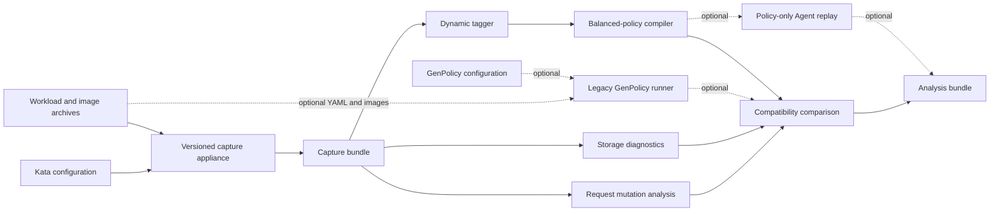

# GenPolicy Appliance Simplification Plan

## Purpose

Refactor the appliance into a fast, versioned request-capture environment for
policy compatibility analysis. The capture appliance should run the real
Kubernetes, containerd, and runtime-rs transformation path, but policy
compilation, Agent replay, legacy GenPolicy, and most analysis should run after
capture and be reusable across many capture profiles.

This document is an implementation roadmap. `DESIGN.md` remains the description
of current behavior until each phase below is complete.

## Decisions

1. The capture bundle is the stable interface between deployment-pipeline
   capture and policy analysis.
2. Kubernetes and containerd versions are exact profile inputs. Do not resolve
   `latest` while running a profile.
3. Rootfs mode is part of the capture profile because it changes the request
   containerd sends to runtime-rs.
4. For EROFS dm-verity, containerd's EROFS differ and snapshotter generate the
   layer blobs, metadata, and real rootfs mounts. Appliance code must not
   reconstruct them.
5. Final Agent requests captured by `RecordingAgent` are authoritative policy
   inputs. Storage-predictor output is diagnostic only.
6. Policy compiler and Agent versions are analysis inputs, not capture-profile
   inputs. Build them once and reuse them across capture profiles.
7. The analysis driver compiles `balanced-policy` by default from captured
   Agent requests. Policy-only Agent replay is an optional validation stage.
8. Legacy GenPolicy is an optional comparison tool invoked through its native
   workload YAML and configuration interface. Its failure must not invalidate
   a complete authoritative capture or balanced-policy analysis.
9. Keep one canonical end-to-end profile on pull requests. Run the wider
   compatibility matrix periodically or when relevant inputs change.

## Target Architecture



The capture appliance owns behavior that can change with Kubernetes,
containerd, runc, CNI, runtime-rs request transformation, or rootfs mode.
Analysis owns tagging, policy compilation, policy execution, legacy comparison,
and cross-profile reporting.

## Capture Bundle Contract

Introduce a versioned capture bundle before moving components out of the
image:

```text
capture/
  manifest.json
  profile.json
  workload.yaml
  submitted-objects.json
  pods.json
  dynamic-values.json
  requested-images.txt
   images/
      index.json
      manifests/
      configs/
  raw-oci/
  createcontainer-requests/
  execprocess-requests/
  logs/
```

`manifest.json` must record:

- schema version;
- exact component and capture-backend versions;
- selected rootfs mode;
- hashes of configuration and capture binaries;
- workload and input-image hashes;
- resolved image manifest and config digests;
- expected and observed request counts;
- hashes of every captured request;
- capture completeness;
- whether outbound traffic was sealed after input acquisition.

Generated policies, policy annotations, Agent evaluation logs, and legacy
results belong in a separate analysis bundle. This separation lets the same
capture be analyzed by different compiler, policy-rule, and Agent revisions.

## Profile Model

Replace the single mutable profile with exact, data-driven profiles under a
`profiles/` directory. A profile selects component versions, capture backend,
configuration variants, and one rootfs mode.

Required rootfs modes:

```text
ROOTFS_MODE=native
ROOTFS_MODE=erofs-dmverity
ROOTFS_MODE=guest-pull
```

`native` is valid only for the runc fallback in the no-VM appliance. A
runtime-rs native rootfs requires a shared-filesystem transport and is outside
the current capture boundary.

Initial profile set:

```text
k8s-1.33-containerd-2.3-guest-pull
k8s-1.33-containerd-2.3-erofs-dmverity
k8s-1.33-containerd-2.3-runc-native
```

The runtime-rs profiles set `REQUEST_AUTHORITY=recording-agent`; their final
Agent requests are authoritative. The runc profile sets
`REQUEST_AUTHORITY=raw-oci`; raw OCI is authoritative, while its subsequently
reconstructed Agent requests are diagnostic only. Add older or newer
Kubernetes/containerd combinations only after these profiles
share the same capture-bundle and analysis interfaces.

Profile identity must include normalized profile content plus hashes of the
containerd, kubelet, CNI, and Kata configuration files. A human-readable name
alone is insufficient.

## Profile Request Mutation Reports

Each profile capture preserves both raw OCI input and final Agent requests.
The analysis driver uses those artifacts to generate two complementary reports:

```text
analysis/request-transformations.json
analysis/profile-request-diff.json
analysis/request-field-provenance.json
```

`request-transformations.json` describes mutations observed within one profile
between the raw OCI input and the final `CreateContainerRequest`, including
runtime-rs additions or transformations that can be compared across those two
representations. It must not attribute fields that have no equivalent raw OCI
representation to a specific component without additional boundary capture.

`profile-request-diff.json` compares equivalent final create and exec requests
from a candidate profile with a declared baseline profile. Group changes by
request section:

- request presence, ordering, identifiers, and flags;
- OCI process, environment, user, capabilities, seccomp, and terminal state;
- OCI root, mounts, Linux namespaces, resources, devices, and annotations;
- Agent storages, devices, and shared mounts;
- stream ports and other request-level fields;
- exec process arguments, environment, user, capabilities, and working
   directory.

For each JSON-pointer path, record whether the value was added, removed,
changed, or reordered, with the baseline and candidate values. Preserve a raw
diff for security review and provide a separately labeled normalized diff for
known deployment identities such as Pod UID, generated sandbox name, and
container ID. Never normalize image hashes, dm-verity data, process arguments,
users, capabilities, seccomp, mounts, storages, devices, or annotations merely
to reduce report noise.

Pair requests by stable workload identity derived from Kubernetes namespace,
Pod or controller identity, container type and name, RPC kind, and exec-probe
identity. Do not pair by generated container ID or capture sequence alone.
Report unmatched and ambiguous requests explicitly.

A standalone profile proves the final request shape, not which profile setting
caused each value. Label cross-profile changes as observed profile deltas. Claim
a specific profile dimension as the cause only when the baseline and candidate
differ in that one normalized dimension and all workload, image, capture, and
analysis inputs are otherwise identical. When several dimensions differ, list
them as candidate causes rather than assigning unsupported causality.

### Field provenance

`request-field-provenance.json` explains where each final request field came
from by comparing the complete sequence of immutable evidence:

1. submitted workload YAML and referenced ConfigMaps and Secrets;
2. API-server-defaulted objects and bound Pod specifications;
3. resolved image manifest and image configuration, stored by digest;
4. CRI-generated raw OCI specifications;
5. final runtime-rs Agent create and exec requests;
6. normalized profile content and component configuration hashes.

Classify each field or collection element as one of:

- `yaml-declared`: explicitly present in workload YAML;
- `image-config`: inherited from the resolved image configuration;
- `kubernetes-defaulted`: added or changed by API defaulting or controllers;
- `kubernetes-resolved`: produced from ConfigMaps, Secrets, downward API,
   service environment, projected volumes, or kubelet volume preparation;
- `cri-generated`: introduced while constructing the raw OCI specification;
- `profile-runtime`: introduced after raw OCI generation by containerd,
   snapshotter, runtime-rs, or the selected rootfs mode;
- `generated-identity`: runtime names, IDs, paths, addresses, and stream ports;
- `mixed` or `unknown`: several sources contribute or available evidence cannot
   distinguish the source.

Each provenance entry contains the final JSON-pointer path and value, source
classification, transformation stage, and pointers into the evidence artifacts.
It also records confidence as `direct`, `derived`, or `ambiguous`. For example,
an environment value uniquely present in the image config is direct evidence;
the winning value after Kubernetes environment precedence is derived from the
versioned inputs; an identical value supplied by both YAML and the image is
ambiguous unless additional boundary instrumentation resolves it.

The ledger also records every relevant static source value even when it does
not survive into the final request. Mark each candidate as `effective`,
`overridden`, `merged`, or `not-projected`, and link an overridden value to the
source that replaced it. This prevents an image environment value hidden by an
explicit YAML value, or a YAML field consumed by Kubernetes but absent from
OCI, from disappearing from the audit trail.

Environment provenance is tracked per variable after applying image, `envFrom`,
explicit `env`, service environment, and field/resource-reference precedence.
Mount and storage provenance is tracked by destination, source type, and stable
volume identity across YAML volume declarations, bound Pod volumes, raw OCI
mounts, and final Agent storages. Rootfs storages and dm-verity options that
exist only in the final Agent request are marked `profile-runtime`; a specific
profile setting is named as their cause only under the controlled comparison
rule above.

Representative results include:

| Final request data | Provenance |
|---|---|
| Image `ENV` retained without an override | `image-config`, direct |
| YAML `env` replacing the same image variable | `yaml-declared`, with the image value marked overridden |
| Service or `envFrom` variable added by kubelet | `kubernetes-resolved` |
| YAML `volumeMount` represented in raw OCI | YAML-to-CRI lineage with both evidence pointers |
| Service-account projected mount absent from submitted YAML | `kubernetes-defaulted` or `kubernetes-resolved` |
| EROFS rootfs storage and `X-kata.dmverity.*` options absent from raw OCI | `profile-runtime`; attributable to `ROOTFS_MODE=erofs-dmverity` only in a controlled one-dimension comparison |

The report must retain source values needed for audit, including secret-derived
environment values, and is therefore sensitive. Redacted presentation may be
generated separately, but it must not replace the hashed authoritative report.

## EROFS dm-verity Capture

### Required data path

For `ROOTFS_MODE=erofs-dmverity`, configure the main capture containerd to use
its built-in EROFS snapshotter and differ for the Kata runtime:

```toml
[plugins."io.containerd.transfer.v1.local"]
  [[plugins."io.containerd.transfer.v1.local".unpack_config]]
    platform = "linux/amd64"
    snapshotter = "erofs"
    differ = "erofs"

[plugins."io.containerd.cri.v1.images".runtime_platforms.kata]
  platform = "linux/amd64"
  snapshotter = "erofs"

[plugins."io.containerd.differ.v1.erofs"]
  mkfs_options = ["-T0", "--mkfs-time", "--sort=none"]
  enable_tar_index = false
  enable_dmverity = true

[plugins."io.containerd.snapshotter.v1.erofs"]
  default_size = "10G"
  max_unmerged_layers = 0
  enable_fsverity = false
  dmverity_mode = "on"

[plugins."io.containerd.service.v1.diff-service"]
  default = ["erofs", "walking"]
```

The intended transformation is:

1. The containerd differ creates `layer.erofs` and dm-verity metadata.
2. The EROFS snapshotter and mount handler pass real rootfs mounts to the
   runtime-rs capture shim.
3. Runtime-rs parses `X-containerd.dmverity=<metadata-file>`.
4. Runtime-rs emits the final `X-kata.dmverity.*` storage options.
5. `RecordingAgent` records those options in `CreateContainerRequest`.
6. The policy compiler extracts the ordered hash array from the captured
   request storages.

Containerd 2.3 contains the EROFS plugins, but the differ still executes
`mkfs.erofs`. The EROFS capture target therefore retains `mkfs.erofs >= 1.8.2`
and the required kernel, loop, and device-mapper support.

Use strict `dmverity_mode = "on"`. Do not use `auto`, because stale layers
without dm-verity metadata could otherwise be accepted silently.

### Synthetic-path equivalence validation

The transition comparison used the same digest-pinned busybox manifest
`sha256:c0aae9d756395ade52df06b55e160e6e32d2ecfe0181ed2c14c68effc5e3fe45`
with containerd 2.3.3 and identical deterministic `mkfs.erofs` options. Both
paths produced one lower layer in base-to-top order with:

```text
roothash=5cca62ebb3022c076db159f46431755bbd315afc5136b82231a91dae998789a9
hashoffset=4472832
```

The old path represented only the protected EROFS lower and its host metadata
path. The real capture additionally records the ext4 upper block storage,
runtime device sources, overlay upper/lower markers, multi-layer marker, and
guest mkdir hints. Thus the integrity pins are equivalent and the real final
Agent request is semantically more complete. The following synthetic components
were removed after this validation:

- disposable per-image containerd instances;
- private snapshot-directory enumeration;
- snapshot parent-chain reconstruction;
- copying EROFS blobs and metadata files;
- synthetic rootfs mount-array assembly;
- in-appliance `capture_rootfs_mounts.py` use for EROFS;
- storage-predictor-derived policy hashes;
- obsolete portions of `prepare_erofs_dmverity.py`.

The real captured Agent storages remain the sole policy hash source.

## Capture Image Contents

The common capture image retains only components needed to produce authoritative
requests:

- Kubernetes API server, kubelet, and kubectl;
- etcd and its command-line client;
- containerd and ctr;
- runc;
- CNI plugins and configuration;
- runtime-rs capture shim;
- Python and capture-side scripts;
- pause and workload fixture archives;
- TLS, networking, namespace, and mount utilities;
- Kata configuration consumed by runtime-rs capture.

Split image targets by behavior:

```text
capture-base
capture-runtime-rs-base
capture-runtime-rs-erofs
capture-runtime-rs-guest-pull
capture-runc-native
```

Only `capture-runtime-rs-erofs` includes `mkfs.erofs` and EROFS-specific runtime
libraries. Native and guest-pull profiles must not build or install EROFS tools.

Remove from the default capture image:

- `genpolicy-oci-compiler`;
- legacy `genpolicy`;
- `storage-predictor`;
- policy rules and settings;
- policy tagging and comparison scripts;
- policy-only Agent replay tooling;
- local registry used only by legacy GenPolicy;
- policy and analysis provenance generation.

## External Analysis Pipeline

Add a host-side analysis driver that consumes a completed capture bundle:

```bash
analyze-capture \
    --capture capture/ \
    --rules src/tools/genpolicy/rules.rego \
    --settings src/tools/genpolicy/genpolicy-settings.json \
    --output analysis/
```

The analysis driver performs:

1. dynamic tagging;
2. `balanced-policy` compilation by default;
3. policy annotation and annotated workload generation;
4. section-aware request transformation and cross-profile mutation reports;
5. field-level YAML, image, Kubernetes, CRI, and profile provenance reporting;
6. optional policy-only Agent replay of every create and exec request;
7. optional storage diagnostics;
8. optional native Legacy GenPolicy comparison from the workload YAML and
   GenPolicy configuration;
9. analysis provenance and reports.

Build `genpolicy-oci-compiler`, policy-enabled `kata-agent`, and
`kata-agent-ctl` once per source revision and reuse them for every profile.

## Policy Compiler Contract

For EROFS profiles, derive per-container ordered hash arrays only from captured
Agent storage options:

```text
X-kata.dmverity-enabled=true
X-kata.dmverity.roothash=<hash>
X-kata.dmverity.hashoffset=<offset>
X-kata.multi-layer=true
```

The compiler must not inspect containerd state, parse
`layer.erofs.dmverity` directly, infer hashes from manifest digests, or accept
storage-predictor output as authoritative.

Fail EROFS policy compilation when:

- an expected lower layer lacks dm-verity metadata;
- strict dm-verity was selected but a captured storage is unprotected;
- layer ordering or request-to-image association is ambiguous.

## Legacy GenPolicy

Move Legacy GenPolicy to a separate optional comparison runner. Invoke the
existing generator through its native workload YAML and configuration-file
interface; do not add a request-derived legacy-compatible compiler path. The
runner may contain its own minimal containerd and registry environment and use
the same workload YAML, GenPolicy configuration, and input images recorded for
the capture profile.

Legacy output is reference data. A legacy-runner failure fails the comparison
stage but does not invalidate a complete authoritative capture or the default
balanced-policy result.

## Storage Predictor

Keep the storage predictor for runtime-rs transformation tests, non-rootfs
volume diagnostics, and synthetic device-address validation. Move its output to
the analysis bundle, for example:

```text
analysis/diagnostics/storages-devices-predicted.json
```

A difference between predicted storage and the final captured Agent request is
a diagnostic finding. It must not modify authoritative policy input.

## Build Optimization

The capture-image build should compile only the selected capture shim. Build
compiler, Agent, Agent client, predictor, and legacy tools separately.

Additional optimizations:

- use BuildKit cache mounts for Cargo registry, Git checkout, and target data;
- isolate component downloads in version-keyed stages;
- keep fixture image construction in version-independent layers;
- copy only capture-side scripts into capture images;
- provide `mkfs.erofs` through a reusable pinned stage or verified artifact;
- verify all downloaded binaries with pinned checksums;
- avoid copying the full repository before dependency compilation where Cargo
  workspace constraints permit.

The desired scaling model is:

$$
N_{profiles} \times capture\ shim + shared\ analysis\ tools
$$

rather than rebuilding every Rust analysis tool for every profile.

## Test Ownership

### Capture tests

- cluster and synthetic node become ready;
- workload objects are accepted and defaulted;
- expected OCI, create, and exec captures exist;
- request files deserialize;
- resolved image manifests and configs match the captured image digests;
- the capture manifest is complete;
- outbound traffic is sealed after input acquisition;
- EROFS profiles contain protected lower-layer Agent storages.

### Compiler tests

- consume checked-in capture fixtures;
- preserve OCI version, seccomp, users, annotations, and storages;
- extract ordered dm-verity hash arrays;
- generate deployable policy and annotations.

### Agent compatibility tests

- when policy-only replay is enabled, authorize all requests from the matching
   capture bundle;
- when policy-only replay is enabled, deny fixtures with modified hashes,
   arguments, users, or annotations.

### Cross-profile tests

- compare request shapes and policy compatibility;
- report added or removed Agent RPCs and fields;
- group request mutations by OCI, process, storage, device, shared-mount, and
   request-level sections;
- preserve raw security-relevant values while separately normalizing only
   declared deployment identities;
- reject ambiguous request pairing and unsupported causal attribution;
- test whether one profile's policy authorizes another profile's requests.

### Field provenance tests

- distinguish image-config environment, command, user, and working-directory
   values from explicit YAML overrides;
- attribute `envFrom`, explicit environment, service environment, downward API,
   and projected-volume results with evidence pointers;
- distinguish YAML volume mounts, CRI-generated mounts, and runtime-rs Agent
   storages;
- mark duplicate or indistinguishable sources as ambiguous instead of choosing
   one silently;
- mark EROFS dm-verity storage options as profile-runtime mutations.

### Legacy comparison tests

- invoke Legacy GenPolicy with the same workload YAML, configuration, and image
   inputs;
- report differences independently of authoritative capture success.

## CI Model

Use three job layers:

1. Build shared analysis tools once.
2. Run the exact-version capture profile matrix and upload capture bundles.
3. Download bundles, analyze them, replay policies, compare profiles, and upload
   analysis reports.

Run the authoritative guest-pull and EROFS profiles plus the runc-native
fallback baseline on relevant pull requests. Run the wider historical and
version compatibility matrix nightly or when profile, capture, containerd,
runtime-rs, Kubernetes integration, or policy files change.

Use Docker/BuildKit as the GitHub Actions image frontend and retain Podman as a
supported local frontend. Do not reuse the Kubernetes CI `CONTAINER_ENGINE`
variable: there it means the host CRI runtime, while the appliance needs an OCI
image build/run command. Rename the appliance variable to
`APPLIANCE_CONTAINER_ENGINE` or `OCI_ENGINE`.

## Implementation Phases

### Phase 1: Capture boundary

- [x] Define capture-bundle schema and manifest validation.
- [x] Store resolved image manifests and configs by digest.
- [x] Split current orchestration into capture and analysis commands without
      changing outputs.
- [x] Make existing E2E run capture followed by external analysis.
- [x] Prove a stored capture can be reanalyzed without rerunning Kubernetes.

Acceptance criteria: the canonical guest-pull profile produces the same
balanced policy and request-derived artifacts as the current combined appliance.
Enabling policy-only replay validates the same five captured requests.

### Phase 2: External analysis

- [x] Move tagging and policy compilation out of the capture image.
- [x] Default the analysis driver to `balanced-policy` compilation.
- [x] Move optional Agent replay out of the capture image.
- [x] Move analysis provenance out of the capture image.
- [x] Build analysis tools once and reuse them across two profile captures.

Acceptance criteria: the capture image contains no policy compiler, Agent,
Agent client, rules, or policy settings.

### Phase 3: Real EROFS capture

- [x] Add strict EROFS dm-verity containerd configuration.
- [x] Route the Kata CRI handler through the EROFS snapshotter.
- [x] Capture real rootfs mounts in the runtime-rs capture shim.
- [x] Assert final Agent requests contain ordered dm-verity storage options.
- [x] Compare old and new hash arrays and storage semantics.
- [x] Make captured Agent storages the sole policy hash source.

Acceptance criteria: the EROFS profile authorizes its own captured create and
exec requests, and no synthetic mount reconstruction contributes to policy.

### Phase 4: Remove redundant components

- [x] Delete synthetic EROFS discovery and mount assembly.
- [x] Move storage predictor to diagnostics.
- [x] Move Legacy GenPolicy to an optional runner that consumes its native YAML
   and configuration inputs.
- [x] Remove local legacy registry from the capture image.
- [x] Split EROFS, guest-pull, and runc-native image targets.

Acceptance criteria: each image target contains only its mode-specific runtime
dependencies.

### Phase 5: Build and profile matrix

- [x] Add BuildKit caches and version-keyed component stages.
- [x] Introduce data-driven exact-version profiles.
- [ ] Add guest-pull and EROFS authoritative pull-request profiles plus the
   runc-native fallback baseline.
- [ ] Add scheduled cross-version compatibility profiles.
- [x] Add intra-profile transformation and baseline-to-candidate request
   mutation reports.
- [x] Add evidence-backed field provenance reports for YAML, image, Kubernetes,
   CRI, and profile-runtime sources.
- [ ] Upload capture and analysis bundles separately.

Acceptance criteria: changing a Kubernetes or containerd profile does not
rebuild compiler, Agent, Agent client, predictor, or legacy GenPolicy.

## Completion Criteria

The simplification is complete when:

- capture bundles are stable, versioned, and independently analyzable;
- capture images contain no policy or legacy analysis tools;
- containerd supplies real EROFS dm-verity rootfs metadata and mounts;
- final Agent requests are the only authoritative policy inputs;
- `balanced-policy` is the default request-derived compilation mode;
- guest-pull and EROFS profiles pass policy-only Agent replay when that optional
   validation is enabled;
- Legacy GenPolicy comparison uses its native YAML and configuration inputs;
- each profile reports section-aware request transformations and profiles can
   be compared against a declared baseline without hiding security-relevant
   values;
- final request fields identify static YAML and image inputs separately from
   Kubernetes, CRI, and profile-runtime mutations, with evidence and confidence;
- adding a profile primarily changes component download and final image layers;
- CI can compare request and policy compatibility across exact deployment
  pipeline versions without rebuilding shared analysis tools.
